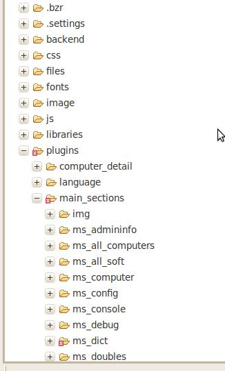
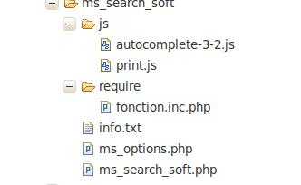
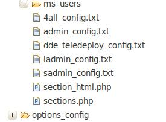
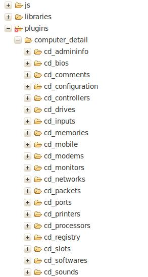
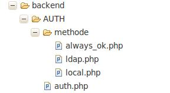
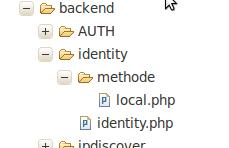
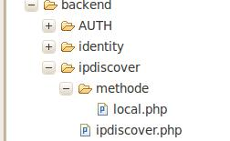

# Developers' Documentation

The version 2.0 of the OCS Web interface has been rethought to allow anyone to bring its development
by a system of module. So, the base of the OCS Web interface is separated from additional modules.

In this version, you can entirely configure your web interface. You can add, remove or modify
fonctionnalities. You can also using external application to control the connexions right
(like LDAP or SSO for exemple).

Finally, you can manage your own profiles and so add or delete rights for it. For example,
you can add the teledeploy to a limited user (even if it is strongly not advised).

# Develope a modules for the OCS web interface

From the version 2.0 of the HCI of OCSInventory-ng, it is possible to create easily its own additional
modules (plugins) and they can become integrated completely into the environment already in production.
For this certain rules of development were organized.

## Architectural rules of code

In a first time, it's important to respect files architecture. It's necessary to create a new branch in
the /plugins/main_sections directory, and named your new directory « ms_<your_module_name> »

Interface icons are in the directory/plugins/main_sections/img. If you want to add an icon associate
to your module, you will have to do it in this directory. The name of the new icon will be in the form
« ms_<your_module_name>.png » for inactive icon and « ms_<your_module_name>_a.png » for active icon.
Add an icon is not an obligation because you can add your module to a menu already in place or even
create a menu on a icon.

Your module must then be composed of a main PHP page with the same name as your directory. Attachments
pages all must begin with « ms_ »

If you have specific functions, you must create a directory « require » in your module, and create
yours functions files in this last. No standard naming is given.

If you have javascript functions to load in the header, you must create a directory « js » in your module,
and create one or many files in this last with « .js » extension. No standard naming is given.

Your module must contain an info.txt file, which provides informations about your module.

In your development, consider that the header and footer php are already managed by the OCS interface.

The structure of your module should look like the example below.

## Integrate your module in OCSREPORTS interface

Integration of module in the OCS interface is made in « 4all_config.txt » file.
This file is composed by differents branchs :

### **ORDER_FIRST_TABLE**

This part defines the icons at the top right to display. The names presented here are the names of files in /plugins/main_sections/img.

### **ORDER_SECOND_TABLE**

This part defines the icons at the top left to display. The names presented here are the names of files in /plugins/main_sections/img.

### **LBL**

Here are the names defined in the display modules. For an icon, text label will appear. We must always use the language files for labels.

### **URL**

This part is useful only for display in the URL of the page. It will be in the form : <module_name> : <url_name_of_module>

### **DIRECTORY**

In this part, you must specify the location of the pages you have created. So, you will have : <page_name> : <my_module_directory> If you have multiple pages, then you will add:

    <page_name_1> : <my_module_directory>
    <page_name_2> : <my_module_directory>

### **MENU**

Here are defined the pages belonging to the menu display. Nous avons donc : <module_name> :
<menu_name> The module name is defined by the name of the icon.

### **MENU_NAME**

Each menu must be defined here. The naming convention is followed as this:

<menu_name> : <name>_smenu

### **MENU_TITLE**

Menu title. It is important to use language files. <menu_name> : g(<number_in_language_file>)

### **JAVASCRIPT**

If you created javascript to load in the header, it must be noted in this section:
<javascript_page_name>.js : <directory_where_the_life_is_located>

Once you have finished to report your module, it only remains to define the profiles having
the rights to access them.

## Access to the module by a profile

Profiles are defined in the directory /plugins/main_sections. They are configured in text files named
XXX_config.txt (Off 4all_config.txt used to the general configuration of the modules). By default,
you have the list below:

If you want to give access to your module to the profile « sadmin », simply edit sadmin_config.txt
file and add your pages names in the section <PROFILE_PAGE>

If your module must be visible to all, you should edit the configuration files of profiles.

**`Warning`**`: If your module contains several visible pages visible to the user, you must declare all.`

Once this is done, your module will be active until the next logon.

# Create a specific profile of connection

From version 2.0 of the OCS Inventory NG web interface , you can create and edit any profile.
All the profiles are defined in the directory /plugins/main_sections. They are configured in text
files named XXX_config.txt (Off 4all_config.txt used to the general configuration of the modules).
If you create your profiles, you MUST respect the architecture of a database file.

## The architecture of a configuration file Profile

Several sections are present in each profile and many variables belong to these sections.
These data are loaded into session variables as :

    $_SESSION['OCS'][<SECTION>][<VARIABLE>]=<VALEUR>

So you can add to your convenience for your developments.

Description of the sections:

### <**RESTRICTION**>

This section defines any restrictions on what will have the profile. By default, we have the following values:

    GUI : Variable that defines if the profile has access to every machine or if it's restricted to TAG machines. Possible values : YES/NO
 

    TELEDIFF_WK : Variable that indicates if the profile has a limited visibility on workflow for teledeploy. Possible values :
                   LOGIN (the profile will only see the requests made by its),
                   USER_GROUP (profile will only see the requests made by its group and itself),
                   NO (The profile will see all requests)

    TELEDIFF_WK_FIELDS : Some fields of workflow for teledeploy may be limited in writing or made invisible. Possible values : YES/NO

### <**ADMIN_BLACKLIST**>

This section allows you to give rights to a profile on the administration of Blacklist values.

    SERIAL : Balcklist administration of serial numbers. Possible values : YES/NO
 

    MACADD : Administration de blacklist des adresses macs. Possible values : YES/NO

### <**CONFIGURATION**>

This section allows you to give the profile some configurations of the interface.

    TELEDIFF : Provides access to teledeploy function. Possible values : YES/NO
 

    CONFIG : Allow you tomanage the configuration of the OCS server. Possible values : YES/NO
 

    GROUPS : Provides the ability to manage groups of machines. Possible values : YES/NO
 

    CONSOLE : Gives console management that displays on the connection. Possible values : YES/NO
 

    IPDISCOVER : Give the management of sub-networks and device types found. Possible values : YES/NO
 

    TELEDIFF_WK : Provides the ability to configure the workflow for teledeploy. Possible values : YES/NO
 

    ALERTE_MSG : Shows or not the messages in the banner of the interface. Possible values : YES/NO

### <**PAGE_PROFIL**>

This section is used to define pages which will be accessible by the profile.
The list of available pages is in the file 4all_config.txt

All changes to a profile or adding a new profile will be visible in user management only at the next logon.

# Add a new section to the details of a machine

Different sections of the details of a machine are managed as independent modules.

## Architecture rules code

It is important to respect the architecture file. It is necessary to create a new section in the directory
/plugins/computer_detail an named you directory as « cd_<your_module_name> »

Icons corresponding to the sections of Machine Details are present in the directory
/plugins/computer_detail/img . The format of these icons respects standard format of OCS icons.

Files of common functions to several modules must be placed in the directory/plugins/computer_detail/require.
In  cases of specific functions to the module, they must be placed in the directory /require within the module.
The module's directory must contain a PHP page with the same main name.

## Modules configuration file

The configuration file is /plugins/computer_detail/config.txt.
It contains of several sections. The first 2 are mandatory and must be completed if you add your own module.
Any change in the configuration file will be visible at the next logon.

### <**ORDER**>

This party set order the modules will be displayed.

### <**LBL**>

This part of the bubble-defined labels that are displayed when moving the mouse over the icon.
It is important to use the language files and therefore follow the structure : <module_name>:g(<line_number>)

### <**ISAVAIL**>

This part is optional. It allows drunk or not an icon, depending on the presence of data in a database.
To make this operational, it is necessary to have the two formats of icon.
You must follow the format  : <module_name>:<table_presence_hardware_id>

# Delegate identification rights to an other application

From version 2.0 of the web interface OCSInventory, it is possible to manage connections in modules.
We must differentiate between authentication and identification. The authentication provide to access
to ocsreports, identification allow to calculate rights for the person who logon.

## Presentation of the code architecture

All the authentication part is in the directory /backend/AUTH

Page auth.php allow to manage the different methods that will be called during authentication.

The list of available methods are present in the directory /backend/AUTH/methode.
By default, 3 methods are available:

    always_ok : accepts any connections to the OCS interface
    ldap : assigns connections to an LDAP directory (settings management across the interface)
    local : Authentication is done using the local OCS Database.

Each method complete 3 variables:

    $login_successful : return OK if the person is authenticated
    $user_group : defined user's group (mainly for the workflow module of software distribution)
    $cnx_origine : return type of method that has validated the user authentication

If you create your own method to delegate authentication's rights to a third-party application,
it is important to respect the filling of these 3 variables.

## Configure Authentication

For the moment, configuration of authentification can be done by editing the code auth.php.

Understanding the parts

It is possible to have authentication

    html : $affich_method='HTML';
    popup. $affich_method='SSO';

To set the authentication method, you must edit the variable $ list_methode. So you can give it
the name of the page that will serve as authentication.

By default, authentication is done with the file local.php.

**`Tip`**`: It is possible to combine the authentication methods.
     You can give many values to the variable $ list_methode`

Exemple :

    $list_methode=array(0=>"ldap.php",1=>"local.php")

As this, the authentication will start with an LDAP authentication and if the user is unknown,
authentication will continue on local OCS database.

f you use a SSO for authentication, it is necessary that it satisfies the variables
$_SERVER['PHP_AUTH_USER'] and $_SERVER['PHP_AUTH_PW'] in order that no request of authentication
is displayed by the OCS interface.

# Delegate calculation of profile rights to an other application

This piece of code to manage the rights to the application as a module. By default,
rights management is on locale OCS database.

## Presentation of the code architecture

All the identification portion is located in the directory /backend/identity

A page identity.php manages the various methods available for identification.

Each method must manage and send 3 variables:

    $restriction : variable retrieved from the configuration file of the profile and witch allow to
    know if the person who connects have right to see all machines present in OCS interface.
 

    $list_tag : if the value of variable $restriction is « YES », this array variable must be completed
    by TAG list that the user is allowed to see
 

    $ERROR : Variable error will appear when an error is encountered

## Configuration of identification

For the moment, the management of identification must be done by editing identity.php

You can change the variable $ list_methode that defines the method that will be used for identification.
This variable is an array.

**`Tip`**` : You can earn rights from multiple method.
     For exemple : $list_methode=array(0=>"local.php",1=>"ldap.php") ;
     lets start by looking for person rights locally connected,
     then search for other rights from page ldap.php.`

# Delegate sub-networks configuration of ipdiscover to an other application

It is possible to manage the list of sub-networks as a module to delegate the calculation
to an other application.

## Presentation of the code architecture

All the identification portion is located in the directory /backend/ipdiscover.
The principle is the same for the previous modules.

Page ipdiscover.php manages the various methods found in the directory /backend/ipdiscover/methode.

Each method should generate an array

    $list_ip[$id][$ipsubnet]=$name
 

    $id value must represent the network ID.
    $ipsubnet value must be the address of the sub-networks.
    $name value must be the wording of sub-networks.

## Configuring ipdiscover

For the moment this configuration can be done by editing the file

    /backend/ipdiscover/ipdiscover.php

Change the variable $list_methode, which is an array type, you can call your own methods.
It is again possible to combine the methods of calculating the ipdiscover.

**`Note`**`: If the calculation of ipdiscover is not made locally, you will have no way to add/delete/modify
the subnets via Web interface, because it will managed from an toher database.`