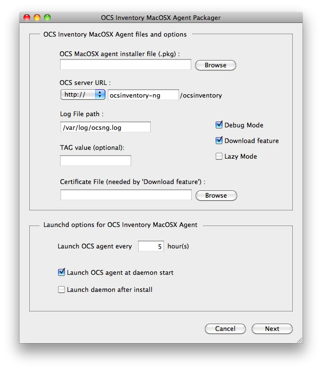
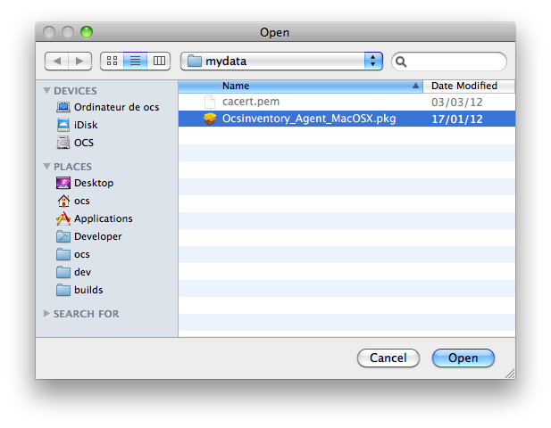
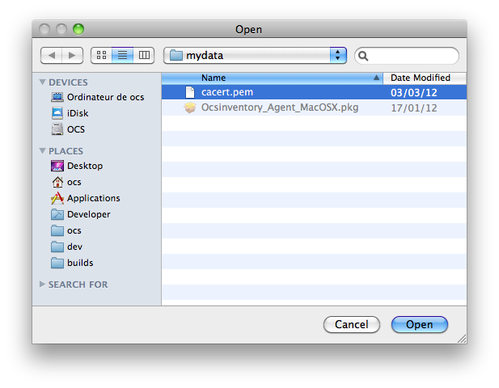
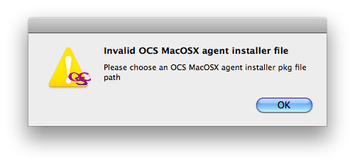
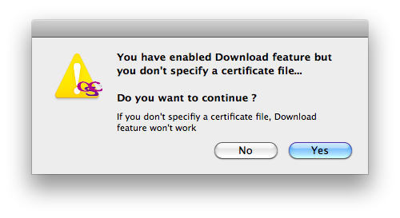
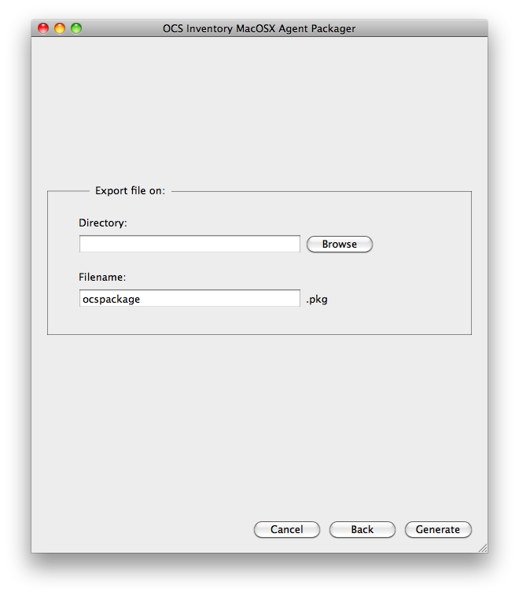
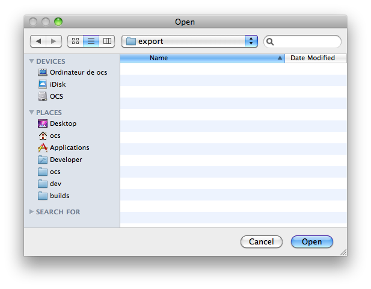
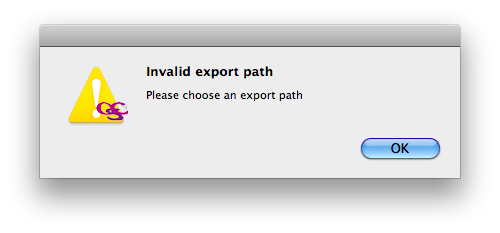
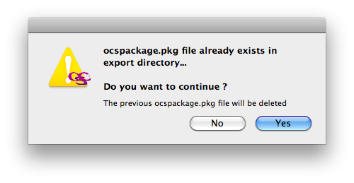
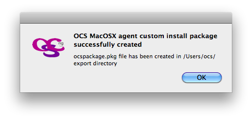

# OCS Inventory NG Packager for MacOSX

## What is OCS Inventory NG Packager for MacOSX ?

OCS Inventory NG Packager for MacOSX is a tool to help you to create a custom OCS MacOSX agent installer.
It will create a custom installer using your configuration such as your OCS server address,
certificate file, debug mode and so much...OCS Inventory NG Packager for MacOSX will create your custom
OCS MacOSX agent installer and you will be able to deploy this installer on your computers using
Apple Remote Desktop, scripts files or OCS Inventory NG package deployment feature (for MacOSX agent upgrade).
Using this installer, you will be able to deploy or upgrade OCS MacOSX agent in a automated way.

## Using OCS Inventory NG Packager for MacOSX

**`Note`**`: OCS MacOSX Packager agent is compatible from MacOSX 10.4 Tiger to MacOSX 10.7 Lion.`

**`Warning`**`: To be able to use OCS MacOSX Packager for MacOSX, you have to download an OCS MacOSX agent
installation file from OCS Inventory NG website download page
`([`http://www.ocsinventory-ng.org/en/#download-en`](http://www.ocsinventory-ng.org/en/#download-en)`).`

Download OCS MacOSX Packager for MacOSX from OCS Inventory NG website download page
([http://www.ocsinventory-ng.org/en/#download-en](http://www.ocsinventory-ng.org/en/#download-en)),
unzip the file and double click _Ocsinventory_MacOSX_Packager.app_.

First of all, choose an OCS MacOSX installer package path by clicking the _Browse_ button.

Set your custom OCS MacOSX agent configuration by choosing serveral options:

* Http or https for OCS MacOSX agent communication to OCS server ("http" by default).
* OCS server server name ("ocsinventory-ng" by default).
* OCS MacOSX agent TAG value (optional).
* Log file path for OCS MacOSX agent ("/var/log/ocsng.log" by default).
* Activate or Unactivate OCS MacOSX agent debug mode for logs (activated by default).
* Activate or Unactivate OCS MacOSX agent packages download feature (activated by default).
* Activate or Unactivate OCS MacOSX agent lazy mode (unactivated by default).
* Periodicity for OCS MacOSX agent to be launched by Launchd daemon (5 hours by default).
* Activate or Unactivate OCS MacOSX agent launch at Launchd daemon start (activated by default).
* Activate or Unactivate OCS MacOSX agent launch, using Launchd daemon, after OCS agent installation
(unactivated by default)

You can set a certificate file path using the Browse Button (mandatory if you activate OCS MacOSX
agent packages download feature). Certificate file must be named as "cacert.pem".

Once you set your custom configuration, click on _Next_ button to validate configuration.

If you do not set a path for OCS MacOSX installer package, you will have this warning:

**`Warning`**`: OCS MacOSX installer package path is mandatory !`

If you activate OCS MacOSX agent packages download feature without specifying a certificate file path,
you may have this warning:

**`Warning`**`: If you activate OCS MacOSX agent packages download feature without specifying a certificate
file path, OCS MacOSX agent packages download feature won't work !!!`

Set export options for generated package:

* Choose an export path by clicking on the Browse button
* Specify a custom filename if needed ("ocspackage.pkg" by default)

If you do not set a export path, you will have this warning:

**`Warning`**`: export path is mandatory !`

If you already have a same named file in export path, you will have this warning:

**`Note`**`: Click Yes if you want to replace existing file. Click No if you do not want to replace existing
file and choose an othe export path.`

When your custom OCS MacOSX agent installer has been generated, you will have this message:

A custom OCS MacOSX agent installer file has been created in export path you set in last window.

## Deploying generated package

You now have your custom OCS MacOSX agent installer file and you will be able to deploy it for a
first OCS MacOSX agent install or for OCS MacOSX agent upgrade. You will be able to deploy this
installer using several tools:

* Command line ( using script for example)
* Apple Remote Desktop
* OCS MacOSX agent (for upgrade only)

### **Using command line**

You can use command line or scripts to deploy your custom OCS MacOSX agent installer file. The better way
is to use the _installer_ command provided by MacOSX. You can use the _installer_ command like this:

    installer -pkg ocspackage.pkg -target /

In this example, our custom installer file is named as _ocspackage_. You will need to use _sudo_
or to be root to be able to use this command. OCS MacOSX agent will be installed on your MacOSX
system without interaction.