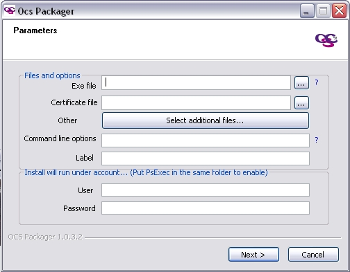
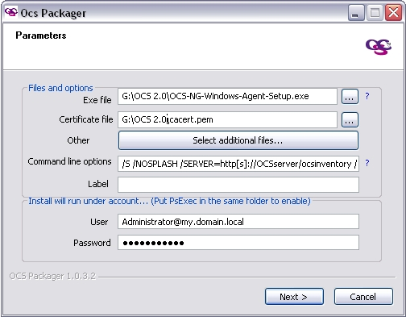
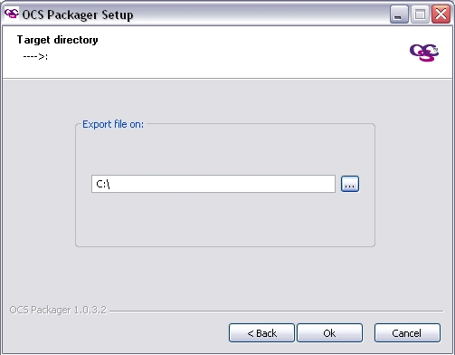

# Use OCSPackager

[Dowload page](http://www.ocsinventory-ng.org/en/#download-en)

## Introduction

**Open Computer and Software Inventory NG Packager** is an application designed to prepare automated
single “Click” end-user installation packages for windows. It also allows use an alternative user
account to perform any kind of scripted task. This Packager is based on the NSIS script and RemCom
utilities open source projects.

OCS Inventory NG **Packager** is GPL software.

i.e. free to use & copy (see [http://www.opensource.org](http://www.opensource.org/)).

OCS Inventory is also Open Source! This means that if you want to modify the sources you can! However,
if you want to change the source code and distribute the changed software, you must provide the source
to your updates as well, as required by the GPL license terms.

## Important notes

**We would like to thank Talha Tariq for the Remcom program. Visit his project at
[http://sourceforge.net/projects/rce](http://sourceforge.net/projects/rce).**

## Manual

### **Prerequisite**

Using OCS Inventory **Packager** is the fastest way to deploy and setup the OCS Inventory NG Agent
on stand alone or domain integrated computers. It is based on the NSIS script and RemCom tools.
It generates a file called **ocspackage.exe** based on your parameters, which allows a one click and/or
a silent user install. Combined with the **OcsLogon /install** parameter this makes a very fast service
deployment on the Windows operating systems easy to achieve.

In this document a number of assumptions are made:

* We assume that you know the domain or local administrative account of your computers.
* You should also know how to generate or obtain a certificate file.
* You are familiar with common Windows administrative tasks.

### **Usage**

Download the **Packager** and the latest
[[OCS-NG-Windows-Agent-Setup.exe](http://www.ocsinventory-ng.org/en/#download-en)]
program from the OCS Inventory Web Site.

Prepare your certificate (needed for software remote deployment).

Launch OcsPackager.exe and accept the License agreement.

The following window will appear:

**“Files and Options” group box:**

* On the **Exe File** line, select your freshly downloaded **OcsAgentSetup.exe** program.
This entry is required !
* On the **Certificate file** line, select your **cacert.pem** file.
* The **other files** line allows additional files to be specified which will be copied to your install folder.
* On **Command line options** line you should enter all the needed options for the Ocs Agent setup
program (e.g. /server=http[s]://my_server/ocsinventory:8181 **/S**). Do not forget to specify the
**/S** option for a silent installation.
* The **Label** line will create a **label** file containing your user prompt. The first time
OcsInventory.exe starts, a popup using this prompt will be shown. The user entered value is called the **TAG**.

**“Install will run under account” group box:**

* On **User** line, enter the local admin account or a domain administrative account. On Active Directory
domains, use “@” to separate the user from the domain name (e.g. administrator@my.domain.com).
On a NT4 domain use the “domain\user” syntax.
* Be careful when entering the password. **It will not be validated at this point !**

You should have something like this:

Click the **[ Next ]** button.

Select the destination folder and Click **[ OK ]**.

At this point windows will briefly appear to generate ocspackage.exe.

You can now test ocspackage.exe by launching it under a normal user account
(no administrative privileges).

A brief Ocs Inventory popup may show indicating the ocspackage.exe has been created.
A log file named ocspackage.log is created at install time.

## Publishing “ocspackage.exe”

You must now upload ocspackage.exe to the communication server or publish it on an alternative
web server if you use the Ocslogon.exe **[/url:]** option.

### **Publishing on the communication server**

Log on to the administration console and select the Configuration icon:

Then upload your **ocspackage.exe** file.

## Deploying agent on a domain

Refer to [[Deploying Agent using launcher OcsLogon.exe through Login Script or Active Directory GPO](../2.Basic-documentation/Setting-up-the-Windows-Agent-2.x-on-client-computers.md#deploying-agent-using-launcher-ocslogonexe-through-login-script-or-active-directory-gpo)]

**`Warning`**`: Mysql server must accept files larger than 5M. Edit `**`my.cnf`**` file and modify
`**`max_allowed_packets`**` value to fix it more than 5M. Save this file and restart service.`

## Other possible usages

As you might have realised, it is also quite possible to use ocspackager to do any other deployment or
administrative task unrelated to OCS Inevtory Deployment feature.

One example is where you've got some computers that you do not want to setup OcsAgent on. These computers
are not attached to your network but you'd like to deploy software without giving administrative
account information or rights to a remote user.

In these situations Ocspackager is very useful because you can package any setup program with its
own options. You just have to know it's silent option.

Administrative tasks can also be performed using a .vbs script. To do this, in “Exe file” field you
should select the full path to your Cscript.exe file, in “other file” select your vbs file,
and in “Command line options” type “[yourBatch.vbs] /B ”

The ocspackage.exe file properties will always contains the packaged file name plus it's version number.

##Interoperability

### **Using Wine under Linux**

OcsPackager works on a Linux server, in an identical as it does under Windows, using the package Wine.

After installing "wine" according to the your distribution, you can two options to run OcsPackager:

* In graphical mode, right click on "OcsPackager.exe" and execute it with "Wine ...",
* In console mode, enter: wine oscpackager_directory / OcsPackager.exe

Once launched, you just have to use OcsPackager exactly as described in this documentation.

## Getting help in forums

If you are unable to diagnose the problem yourself, you can get help using OCS Inventory NG web site forums
([http://forums.ocsinventory-ng.org/](http://forums.ocsinventory-ng.org/index.php#idx1)).

If you do so, please provide us with the following:

* Server operating system
* OCS Inventory NG server version and patch level
* Agent’s operating system
* OCS Inventory NG agent version
* Agent execution logs
    * Run _“AGENT_INSTALL_FOLDER\ocsinventory.exe /NP /DEBUG=2 /SERVER=http://your_server_address/ocsinventory”_
     under Windows. Log file is created on folder “AGENT_INSTALL_FOLDER” under name “ocsinventory.log”.
    * Run _“ocsinventory-agent --debug > ocsinv.log”_ under Linux. Log file is “ocsinv.log”.
* Apache server error.log file, located for Windows under _“SERVER_INSTALL_FOLDER\xampp\apache\logs\error.log”_
and for Linux under _“/var/log/httpd/*error.log”_.
* OCS Inventory NG Server log file, located for Windows under
_“SERVER_INSTALL_FOLDER\xampp\apache\logs\ocsinventory-NG.log”_ and for Linux under
_“/var/log/ocsinventory-NG/ocsinventory-NG.log”_ under Linux.

Thanks in advance.
