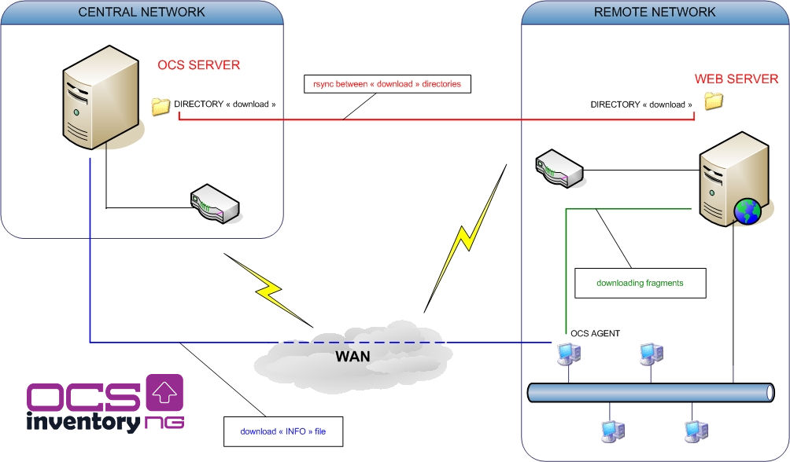
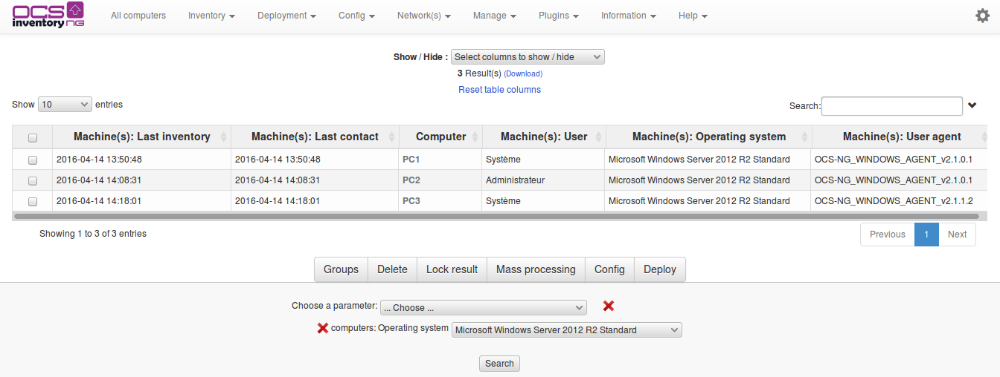

# Using redistribution servers

Redistribution servers have the role of provisioning deployment packages created on the OCS server
Inventory NG locally. The main advantage of this solution is the reduced use of your WAN bandwidth
when agents have to download a package. They will download the package on redistribution server hosted
locally, instead of downloading package on OCS Inventory NG server, and therefore don't use WAN connection
(except to download the file info which is hosted on the OCS Inventory NG server).

**`Note`**`: "INFO" file is downloaded in HTTPS
(`[`https://OCSserver/download/IdPackage/INFO`](https://OCSserver/download/IdPackage/INFO)`)
and fragments are downloaded in HTTP
(`[`http://WEBServer/download/IdPackage`](http://WEBServer/download/IdPackage)`)`

## Configuration of web interface

### **Viewing redistribution groups**

To see groups already created, click on Inventory, groups and then on _REDISTRIBUTION GROUPS_ tag.

When you click on the name of the group , a new window is opened. In the blue box at the top,
you can see various informations about the group :

* Name of the group
* Creation date
* Request ( SQL request corresponds to various search criteria for dynamic groups)
* Description

You can edit the description and name of the group by clicking on the pencil.

In the table below, you can see the machines connected to the group of redistribution.

### **Create a group of redistribution**

Groups of redistribution correspond to the result of various multicriteria search. For exemple, if you
do a multicriteria request returning the computers with Linux operating system, and apache package
installed, then all the machines that meet this criterion at the time of research can be added to a
group of redistribution. Group of redistribution content will not change unless you add/remove machines
in this group, or using an other multicriteria research.

To create a group of redistribution, you have to do first a multicriteria search. Click on
_Search with various criteria_ in Inventory, select your parameters, and click on Search button.
In the result table, select the machines you want to add to the group of redistribution by checking
the appropriate box (you can click on Page to select all machines). Click on _Groups_ at the
bottom of the table result.

Select the tag corresponding to the type of group you want to create. In our case, _REDISTRIBUTION GROUPS_,
then in the dropdown menu, choose _Create a group_.

Now, add informations in differents fields :

* _Name_ : enter the name of the group here
* _Description_: add a description of this group here

Then, click on _Send_.

Now, you can see your new group of redistribution, as previously described, clicking on _Inventory_,
then _Groups_ and finally _Groups of redistribution_ tag.

### **Add computers to a group of redistribution existing**

You can always be taken to implement a new server of redistribution. You have to inventory this server
in a first time, in order to add it to a group of redistribution

First, do a multicriteria search. Click on _Inventory_ and then on _Search with various criteria_,
select your parameters, and click on Search button. In the result table, select machines you want to add
to the group of redistribution by checking the appropriate box (you can click on Page to select
all machines). Click on _Groups_ at the bottom of the table result.

Select tag corresponding to the type og group you want to create. In our case, _REDISTRIBUTION GROUPS_,
then in drop-down menu, choose _Add to Group_. A new drop-down menu appears. Select the group you want
to add the new machine.

Then, click on _Send_.

Now, you can see your new group of redistribution, as previously described, clicking on _Groups_ in Inventory,
and then Groups of redistribution tag.

### **Overwrite an existing group**

First, do a multicriteria search. Click on _Inventory_ and then on _Search with various criteria_,
select your parameters, and click on Search button. In the result table, select machines you want to add
to the group of redistribution by checking the appropriate box (you can click on Page to select
all machines). Click on _Groups_ at the bottom of the table result.

Select tag corresponding to the type og group you want to create. In our case, _REDISTRIBUTION GROUPS_,
then in drop-down menu, choose _Overwrite a Group_. A new drop-down menu appears. Select the group you
want to overwrite.

Then, click on _Send_.

Now, you can see your new group of redistribution, as previously described, clicking on Groups icon,
and then Groups of redistribution tag.

## Synchronisation of packages between servers

After declaring groups of redistribution in the web interface, you have to implement a synchronization
of download directory from the main deployment server to redistribution servers.

Here, an exemple of a script to make the synchronization of the download directory,using SSH protocol(rync).
There is a service rsyncd you can install if you use Windows on your servers of redistribution (IIS)(see
[here](http://cygwin.com/)).

**`Warning`**`: You have to synchronize `**`download`**` directory before activate package automatically
in web interface.`

**`Note`**`: When you activate the package automatically in web interface, script verify that the package directory
exists on servers of redistribution. If this directory is not found by the script to the URL entered,
you will get a warning message.`

### **Script of synchronisation**

**`Note`**`: In the example, the redistribution servers are configured basically. Download directory
is in /var/www.`

`You can place your download directory where you want, provided to properly change the configuration
of your apache server (or IIS), and your OCS server (configuration in web interface)`*

    ##########################################################
    # OCS INVENTORY   -    TRANSFER OF DOWNLOAD DIRECTORY
    ##########################################################
    # Guillaume PRIOU & Frank Bourdeau
    ##########################################################

    echo "Transfert on redistribution server A"
    #Synchronisation of download directory containing all OCS packages
    rsync -a /var/lib/ocsinventory-reports/download/ IP_REDISTRIBUTION_SERVER_A:/var/www/download

    #Script will be launch every day at 05h30 morning
    #It's possibleto put a guard dog at 06:00 to make sure
    # that transfer is not planted and that a process runs for nothing
    heure=`date +"%H%M"`
    if [ $heure -gt 0600 ]
    then
        echo "Transfert on redistribution server B"
            #Synchronisation of download directory containing all OCS packages
        rsync -a /var/lib/ocsinventory-reports/download/ IP_REDISTRIBUTION_SERVER_B:/var/www

    fi

### **CRON job**

Add in crontab file this line (You have to save your script. In exemple : /home/web/syncOCSpackages.sh)

    #Performing daily at 5:30 sync script of OCS packages
    30 05 * * * root /home/web/syncOCSpackages.sh
