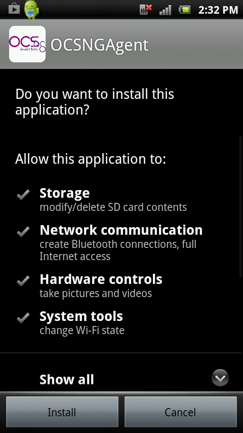
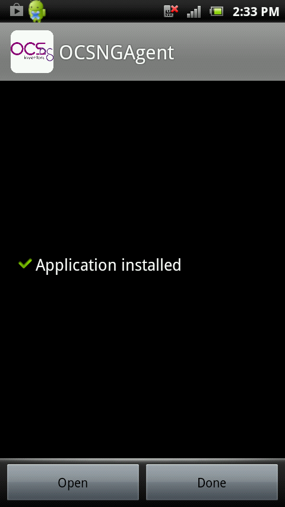
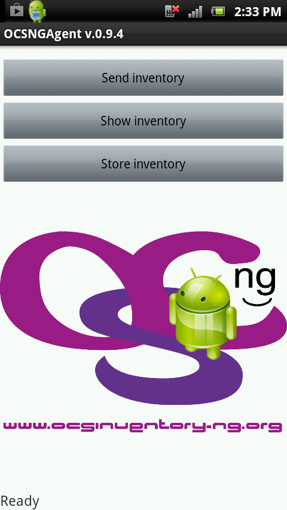

# Android Agent Documentation

## Operating principe

**OCS Inventory NG Agent for Android can run as a service** automatically at boot
time. **It can also work as a stand alone application** launched manually.

## Which version: Service or Standalone ?

The Windows service version will automatically communicate with the OCS-NG
system and perform inventories based on parameters set on the server
(Inventory Frequency). The standalone client is used for computers that
cannot communicate with the server, or where the service version is not
wanted or allowed.

When an inventory is done, agent uses and writes in files stored in directory
"SDCARD/ocs". This directory is **/mnt/sdcard/ocs**.

## Prerequisites

Have a device under Android 2.1 or higher.

## Installation of Android Agent

2 solutions to install Android agent.

[From OCS repository on Launchpad](https://launchpad.net/ocsinventory-android-agent)
: Download and uncompress the lastestversion of Android Agent from download page of our website.
This package contains file :

**`OCSInventoryAgent-0.9.0.apk: install Android agent, without any specific configuration.`**

Place this file on SDCARD and launch it.

* From Android Market : Download application and launch installation.

When you launch installation, you authorize the application to access to different information and data
of your device. You can list its before clicking on **Install**.

At the end of installation, icon is created on desktop, and a message prevents you application was installed
correctly. Click on **OK** to quit installer, or on **Open** to quit installer and launch application.

Now you see the main screen of the application, which allows you to:

* send an inventory (you will have to fix the configuration before)
* display inventory (section by section)
* store inventory on your SDCARD (/mnt/sdcard/ocs/inventory.xml)
* edit the configuration, using configuration standard menu of Android

## Configuration of Agent

By clicking on configuration standard button of Android (different depending on the device),
4 menus are available:

* **Configuration** : Access to agent configuration
* **About : About OCS** Inventory NG agent installed
* **Import configuration** : Import a configuration file if present in directory ocs
* **Export configuration** : Export the configuration to backup or using on others devices

### **General Configuration of agent**

* **TAG** : Cathegory TAG in OCS
* **DEBUG** : possible to generate a trace file in the **ocslog.txt** agent directory
* **AUTOMATIC** : define if agent works as a service or a standalone application
* INVENTORY FREQUENCY : define frequency between 2 inventories (in hours)
* WAKE FREQUENCY : define time between 2 verifications of time since last inventory
* **CACHE** : possible to recordd inventory cache on device
* CACHE LIFETIME : define cache timelife (in minutes)

### **Configuration concerning server**

* **SERVER URL** : define URL address of OCS Inventory NG server(By default:
[http://ocsinventory-ng/ocsinventory](http://ocsinventory-ng/ocsinventory)).

    **`Note: If your OCS Inventory NG server listens on an other port than classic port, you have to define it in serveur URL.
    Example :`[`https://ocsinventory-ng:4443/ocsinventory`](https://ocsinventory-ng:4443/ocsinventory)**

* **SSL CONTROL** : possible to active and desactive SSL control.
* **AUTHENTIFICATION** : define if server needs authentification. If yes, you have to define
**Login** and **Password**.
* **HTTP PROXY** : define if agent use a proxy. If yes, you have to define **Address** and
**port** of proxy server.

**`Warning: To work with SSL control, you have to import CA in Android. To do this, use menu Localisation
and security/Import certficate from SDCARD. Certificates MUST BE in the root of SDCARD. Extensions .crt and .cer are detected. Extension
.pem isn't always.`**

## Feature of import/export configuration

This feature allows to export agent configuration when defined, to import in others devices.
**org.ocsinventory.android.agent_preferences.xml** file containing configuration parameters to
import/export is stored in directory "ocs".

**`Note: To import/export configuration, the device (phone/tablet) should not be connected
via USB to a computer.`**

It's possible to edit the file manually as you want.

    <?xml version='1.0' encoding='utf-8' standalone='yes' ?>
    <map>
    <boolean name="k_strictssl" value="false" />
    <boolean name="k_debug" value="false" />
    <string name="k_freqmaj">24</string>
    <long name="k_lastupdt" value="1361266849907" />
    <boolean name="k_automode" value="true" />
    <boolean name="k_cache" value="true" />
    <string name="k_devicetag">SONY ERICSSON</string>
    <string name="k_cachelen">900000</string>
    <string name="k_freqwake">30</string>
    <string name="k_serverurl">https://ocsinventory-ng/ocsinventory</string>
    </map>
