# OCS Inventory NG Agent 2.X on Windows Operating Systems

**`Note`**`: OCS Inventory NG Agent 2.X does not work on Windows 9X, Windows Millennium Edition or Windows NT4.
You need to use old 1.X agent 4061-1.`

**OCS Inventory NG Agent for Windows can run as a Windows service** automatically at computer startup.
**It can also work as a stand alone application** which can be launched through a login script, an Active
Directory GPO, a scheduled task or a shortcut in the Start menu.

**`Note`**`: We recommend using the service version of the Agent, especially if you plan to use the package
deployment feature.`

Download and unzip the latest Windows agent from the Downloads section. This package contains 2 files:

*  **OCS-NG-Windows-Agent-Setup.exe**: installs the Windows Agent, either as a Windows Service or as a
Standalone tool.
* **OcsLogon.exe**: installs the agent by downloading binaries from Communication server, or runs the agent
if already installed. It will install either the service or the standalone version based upon a
command line switch.

## Which version: Service or Standalone ?

The Windows service version will automatically communicate with the OCS-NG system and perform inventories
and package deployment based on parameters set on the server. The standalone client is used for computers
that cannot communicate with the server, or where the service version is not wanted or allowed.

### **How does Windows Agent work ?**

When the OCS Inventory NG Agent is launched, it queries the Communication server using the HTTP
or HTTPS protocol. The server can answer “nothing” (not time for an inventory and no package to deploy),
and the agent stops. Otherwise, the server may answer that Agent has to:

* **Send an inventory**: the agent retrieves all computer properties and sends them using HTTP
or HTTPS protocol to the server. The server ask this only if the last inventory date in the database
is older than the general option “FREQUENCY”, specified in days (see
[Managing OCS Inventory NG general options](Administration-of-OCS-Inventory-NG.md#managing-ocs-inventory-ng-general-options).)
* **Discover the network**: Agent scans his IP subnet for active devices listening on the network,
then sends these data using HTTP or HTTPS protocol to the server. The server ask this only if the
computer is elected to run IPDISCOVERY (see
[Using IP discovery feature](../../05.Network-Discovery-with-OCS-Inventory-NG/Using-IP-discovery-feature.md).)
* **Deploy a package**: Agent contacts the deployment server using the HTTPS protocol to get the information file
(file INFO which describes the package), downloads package fragments from the deployement server,
rebuilds the package and launches it.

**`Note`**`: The OCS Inventory NG Agent does not listen on the network. It only initiates communications to
the server, so you do not have to open inbound port on a personal firewall. However, you must allow
outbound connections from OCS Inventory NG agent files “OCSInventory.exe” and “Download.exe”
to the Communication Server or Deployment Server using either HTTP or HTTPS.`

Each time an inventory is done, the Agent uses and writes configuration files stored into folder
“%ProgramData%\OCS Inventory NG\Agent”. This directory is usually

* **C:\Documents and Settings\All Users\Application Data\OCS Inventory NG\Agent** under Windows 2000, XP and 2003.
* **C:\ProgramData\OCS Inventory NG\Agent** under Windows Vista, 2008, Seven and 2008 R2.

It uses at least the following files:

* **ocsinventory.ini**: all configuration parameters for the agent (server address and credentials,
proxy address and credentials, service properties...),
* **ocsinventory.dat**: computer unique identity file, based on MAC address and hostname,
* **last_state**: last inventory state, to detect changes between 2 inventory,
* **history**: package deployment history,
* All log files created by OCS Inventory NG Agent.

**`Note`**`: YOU MUST STOP “OCS Inventory Service” to make changes on these files, because they are write
protected while service is running. As is, only user having Administrator privileges can modify these files.`

When launched for the first time, OCS Inventory NG agent will prompt user for the TAG value
(if this feature is enabled). Help text displayed in the dialog-box is the one you have entered
in Configuring management server. User may enter this value, or leave it blank (you will be able
to update this value through the Administration server).

Then (or otherwise if TAG feature is not enabled), it will do the inventory and send inventory
results to Communication server using HTTP or HTTPS.

**`Note`**`: When the agent is first launched, it will only generate and send an inventory.`

### **How does Windows service work?**

**`Note`**`: You must have Administrator privileges to set up OCS Inventory NG Agent as a service,
or you may use OCS Inventory NG `[`Packager`](../../english/06.OCS-Tools/OCS-Packager.md)
`to create an installer able to run even if user do not
have Administrator privileges. Refer to`
[`Uploading Agent for deployment through launcher “OcsLogon.exe”`](Administration-of-OCS-Inventory-NG.md#uploading-agent-for-deployment-through-launcher-ocslogonexe)
`or OCS Inventory NG `[`Packager`](../../english/06.OCS-Tools/OCS-Packager.md)` documentation.`

* OCS Inventory NG Agent “OCSInventory.exe” is launched by service “OcsService.exe” every **PROLOG_FREQ** hours.
It keeps trace of the countdown in seconds in file “ocsinventory.ini” (value **TTO_WAIT**), so it is the time
of EFFECTIVE run.
* The number of hours to wait is randomized at install time and each time PROLOG_FREQ is changed in
Administration Console.
* It allows not having all agents contacting Communication Server at the same time. The randomization
is between 0 and PROLOG_FREQ (10 hours by default). You can adjust these parameters considering your
server load using Administration Console.

When service launch agent, it call without parameter, so agent uses parameters specified in file “ocsinventory.ini”.

As you can see, Service is only a launcher which will run Agent regularly, even if nobody logs in the computer.

### Do I have to use service or standalone agent ?

* **You want to have computers inventoried, even if nobody log in ?** Use Service version.
* **You want to use package deployment feature ?** Use service version. As is, package will be downloaded
in background, and logged in user can continue to work.
* **You do not want to set service up or have anything appears in the registry ?** Use standalone version.
However, deployment of package may take a long time when users log in.

In other words, we recommend using service version.

## Manually installing OCS Inventory NG Agent for Windows.

Run “OCS-NG-Windows-Agent-Setup.exe” on client computer..

..and click “Next” button

Validate license agreement by clicking “I agree” button.

Select the installation type you want:

* **Network inventory**: Computer can reach OCS Inventory NG Server through the network, and so,
Agent will be launched using either a Windows Service, or a Logon/GPO script.
* **Local inventory**: Computer is not connected to a network, or will never be able to reach
OCS Inventory NG Server. You can generate an inventory of this computer and save to file to be imported
later on server (see chapter **Generating inventory of a non network connected Windows computer** below).

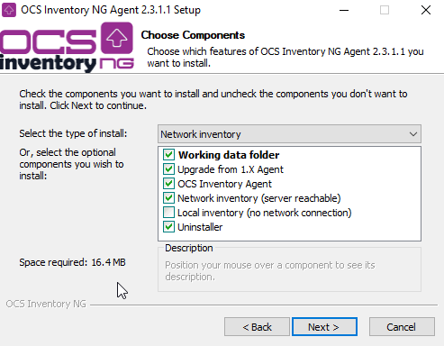

Fill in OCS Inventory NG Communication server URL, like
[http://your_ocs_server_address:your_server_port/ocsinventory](http://your_ocs_server_address:your_server_port/ocsinventory)
. You can also specify https if your server is SSL enabled to secure communication.
If you've protected your Communication Server access with credentials, you must specify credentials
agent will use to authenticate (these credentials will be encrypted to be stored into configuration file).
If you're aware of server certificate validation when using HTTPS protocol, either for sending inventory
or deploying package, you can disable it. **However, this is a security flaw! We do not recommend disabling
certificate validation because Agent does not authenticate server**. With certificate validation enabled,
you must specify path to Certificate Authority root certificate (default uses
"%ProgramData%\OCS Inventory NG\Agent\cacert.pem"). Then click “Next” button.

**`Note`**`: You can use self-signed certificate, but certificate CN must equal to server address used by agents
for communications. Also, if full path to certificate is not provided, agent will try to load the specified
file from its data folder "%ProgramData%\OCS Inventory NG\Agent".`

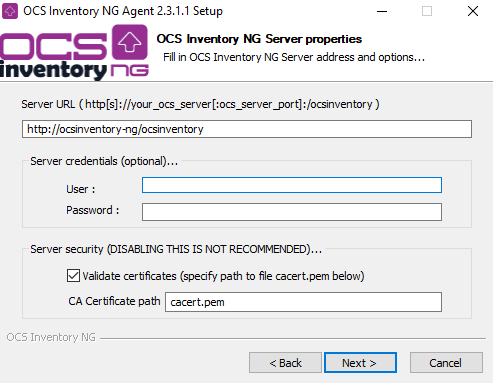

If needed, select proxy type to use to connect to Communication Server, proxy address and port, and
proxy credentials if required (these credentials will be encrypted to be stored into configuration file).
Agent support HTTP, SOCKS 4 and SOCKS 5 proxies.

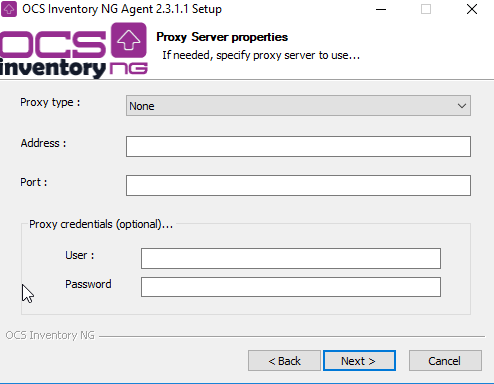

By default, OCS Inventory Agent write only few information in log files. You may increase
this enabling “Verbose log”. You may also disable TAG question, or specify the TAG value. Last,
indicate which level of system integration you need:

* Do not register service using LocalSystem account (i.e, use standalone agent, which must be launched manually or using login script).
* Do not configure OCS Inventory NG Systray Applet to start automatically when user log in. This applet allows user to manually run agent, or to display inventory information. Disabling this option does not create shortcut link in "All users" startup menu.
* Launch inventory just at the end of setup.

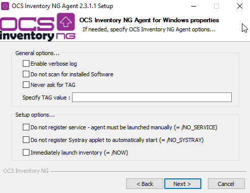

Choose destination folder, “C:\Program Files\OCS Inventory Agent” by default
(“C:\Program Files (x86)\OCS Inventory Agent” under Windows 64 bits), and click “Install” button.

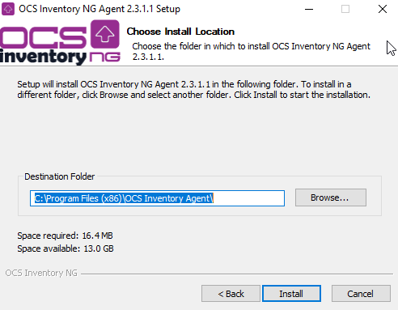

Click “Finish” button to close OCS inventory NG Agent Setup.

This is the interactive installation setup. However, this process requires that you launch it under
all your computers. Hopefully, this installation can be scripted.

### **OCS Inventory NG Agent for Windows Setup command line options**

Service Agent setup “OCS-NG-Windows-Agent-Setup.exe” may be called with some command line parameters:

* **/S** to run the installer in silent mode, no interaction with user
* **/NOSPLASH** disable splash screen when installer starts
* **/UPGRADE** to deploy new agent through OCS deployment feature. Because you upgrade agent using agent itself
to run the upgrade, it is needed to notify the installer (which terminates agent's processes) to specify the
result in order to send it back to the server next time agent will run
* **/NO_SERVICE** to not register OCS Inventory NG Agent into Windows Service Manager. Agent can only be
launched manually or through a script/GPO.
* **/NO_SYSTRAY** to not create a shortcut into "All Users" startup folder to start systray applet when user
log in.
* **/NOW** to launch inventory just after setup
* **/NOSOFTWARE** to ignore software installed
* **/D** to install ocsinventory agent in an another directory (default %PROGRAMFILES%\ocs inventory agent)

Also, you can pass to the installer the following agent's command line parameters
(see agent's options below for more detail):

* /SERVER=
* /USER=
* /PWD=
* /SSL=
* /CA=
* /PROXY_TYPE=
* /PROXY=
* /PROXY_PORT=
* /PROXY_USER=
* /PROXY_PWD=
* /DEBUG=
* /NOTAG
* /TAG=
* /D=

## Deploying Agent using launcher OcsLogon.exe through Login Script or Active Directory GPO

Launcher “OcsLogon.exe” is a small tool able to run inside a login script or an Active Directory GPO.
Its purpose is to setup Agent, if not already installed on client computers, and to launch the
OCS Inventory NG Agent if you don't not want to use the service.

* To deploy Standalone Agent with launcher, **you first must have uploaded Standalone Agent** file
“ocsagent.exe” or “OCSNG-Windows-Agent-Setup.exe” to the server using Administration Console.
* To deploy Service Agent with launcher, **you first must have uploaded the Service Agent** file
“OCSNG-Windows-Agent-Setup.exe” or all-in-one installer “ocspackage.exe” (See Using OCS Packager
to create an all-in-one installer to setup agent and server certificate) to the server using
Administration Console.

**`Note`**`: Refer to § Uploading Agent for deployment through launcher “OcsLogon.exe”.`

Launcher “OcsLogon.exe” will try to connect by default to Communication Server
using URL [http://ocsinventory-ng/ocsinventory](http://ocsinventory-ng/ocsinventory).

To use a different URL, you must provide **“/SERVER=http[s]://your_server[:your_port]/ocsinventory”**
command line parameter (strings between [] are optional).
For example, if your server uses HTTP protocol, and is located on computer
192.168.1.2 on port 80, you must use “/server=http://192.168.1.2/ocsinventory”.
If your server requires HTTPS on port 8443, you must use “/server=http**s**://192.168.1.2:**8443**/ocsinventory”.

**`Note`**`: Always use the latest version of OcsLogon.exe.
You can get it from the latest package OCSNG-WINDOWS-AGENT_XXXX.zip.`

Launcher will first check if OCS Inventory NG Agent is installed, and if not,
will contact Communication Server in HTTP/HTTPS to download latest Agent installer and run it on the computer.

Launcher OcsLogon.exe can use the following command line parameters:

* **/PACKAGER** setup all-in-one installer “ocspackage.exe” (See Using OCS Packager to create
an all-in-one installer to setup agent and server certificate), to install Agent and server
certificate even if user does not have Administrator privileges.
* **/GPO** tell Launcher that setup file to download is in the same folder as OcsLogon.exe.
So, OcsLogon does not try to download setup file from Communication Server, but try to use
the one copied in the GPO folder.
* **/URL=http[s]://your_server:port/path_to_file_to_download.exe** tell Launcher that setup file
is located at provided URL, instead of Communication Server.
* **/DEPLOY=a.b.c.d** ensure there is at least the specified version installed. OcsLogon
install/upgrade Agent only if installed version is lower than the specified one "a.b.c.d".
* **/FORCE** force reinstalling agent, even if the installed version is newer or equal to
the specified one. Use it to downgrade version for example. CAUTION, USE THIS OPTION WITH CARE,
as Launcher will setup agent each time.
* **/TIMEOUT=x** (milliseconds) allow to modify default download timeout of 60 seconds.
* **/UNINSTALL** uninstall agent, instead of installing it.

You must also provide standard agent setup command line parameters (see OCS Inventory NG Agent
setup command line options for more detail), and at least:

* **/SERVER=http[s]://you_cs_server[:port]/ocsinventory**, URL to connect to OCS Inventory NG
Communication Server.
* **/NO_SERVICE** to not register OCS Inventory NG Agent into Windows Service Manager and so
uses standalone agent. Launcher will then launch Agent each time. Otherwise, it will never run Agent,
assuming Agent is launched by Windows Service.
* **/EDITLOG** to display OcsLogon log generated through /DEBUG using notepad.
**Warning** : This option works only with logon script or User GPO.

**`Note`**`: Launcher OcsLogon.exe always create a log file “OcsLogon.log” into temporary folder.`

   * `When launched through a computer GPO, this folder is usually “C:\Windows\Temp”.`
   * `When launched through a user GPO or login script, this folder is usually “C:\Documents and
   Settings\User Profile\Local settings\Temp” or “C:\Users\User Profile\AppData\Local\Temp”.`

### **Deploying or running Agent through Active Directory GPO**

**`Note`**`: We recommend using service version of Agent if you plan to use package deployment feature.`

Open “Group Policy Manager” tool.

**`Note`**`: You can run GPO Manager directly by using gpmc.msc command.`

Navigate in left pane to display “Group Policy objects” of your domain.

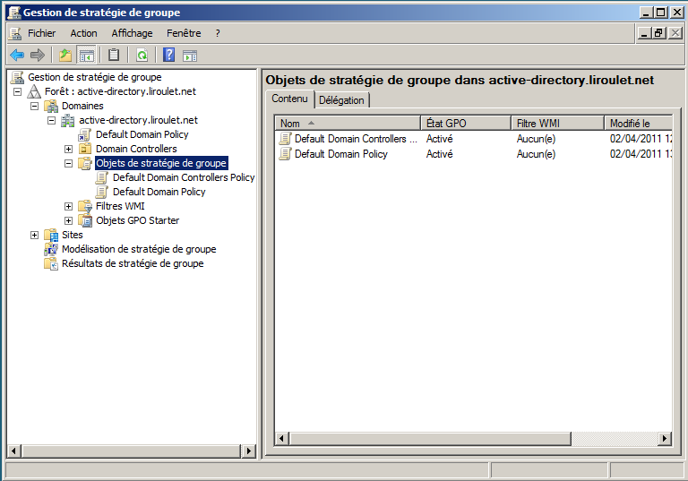

Create a new policy, or edit existing one.

You can either use Computer policy, or User policy. Computer policy will run at computer startup
or User policy will run at user login.

**`Note`**`: In our example, we will use Computer policy and Startup script. Communication Server address
is “ocs.mycompany.tld”, and we choose to set up Service Agent version using Packager all-in-one installer
“ocspackage.exe” (See
`[`Using OCS Packager to create an all-in-one installer to setup agent and server certificate`](../../english/06.OCS-Tools/OCS-Packager.md)`
). If you choose to use Standalone Agent, it’s better to use User policy and startup script,
to allow agent running each time a user log in.`

Expand “Computer configuration” tree in left pane and navigate as shown below to “Windows settings”
and “Scripts”.

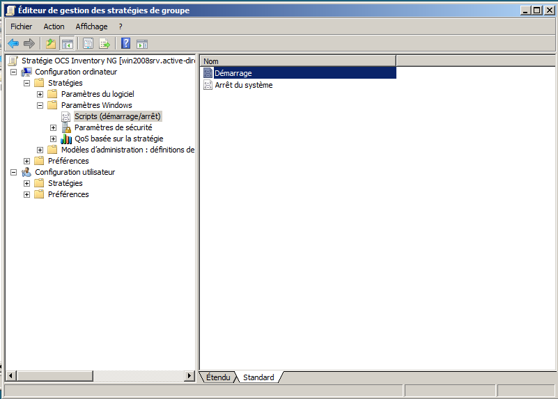

Then double click on “Startup” on right pane.

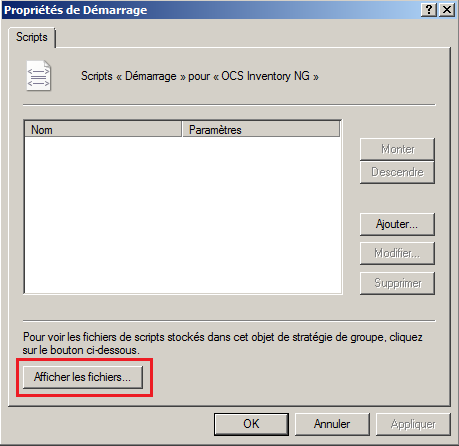

Click on “Show files” button to display script and executable files usable by GPO and copy into this folder
Launcher “Ocslogon.exe” and all-in-one installer “Ocspackage.exe” files.

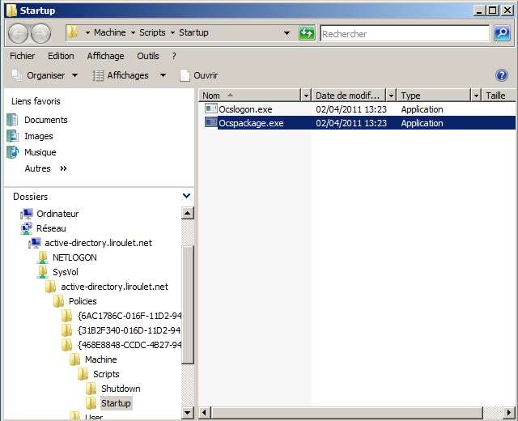

Next close “Startup” folder and click “Add” script button, click “Browse” button to select launcher
“OcsLogon.exe” , and fill in Launcher parameters, in our example :

* “/PACKAGER” to use OCS Packager all-in-one installer,
* “/GPO” to use setup file located in the same folder as OcsLogon.exe aka the GPO folder,
* “/DEPLOY=2.0.0.15” to ensure at least Agent version 2.0.0.15 is installed,
* “/SERVER=http://ocs.mycompany.tld/ocsinventory" to use Communication Server URL
[http://ocs.mycompany.tld/ocsinventory](http://ocs.mycompany.tld/ocsinventory).

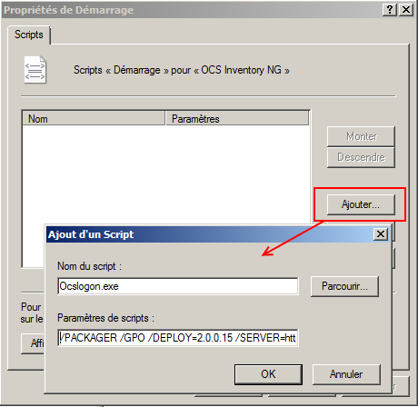

Validate each window to activate Computer Startup script GPO.

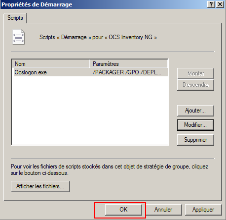

Update if needed default GPO filters to meet your needs, for example to apply this GPO only
to specified Active Directory or site.

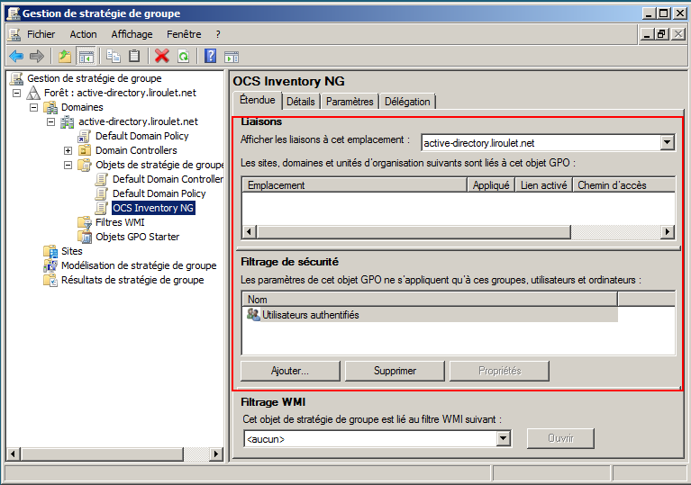

When computer will start (or when user will login if using User policy), launcher will set up
if needed OCS Inventory NG Agent as a service.

### **Deploying or running Agent through login script**

**`Note`**`: We recommend using service version of Agent if you plan to use package deployment feature.`

Copy files “OcsLogon.exe” to a shared folder somewhere in your network.
This folder must be readable by all your users. Then add a call to “OcsLogon.exe” in your users login script.

Here is a sample login script.

**`Warning`**`: Below code requires additional checking for internal LAN configuration, but is functionally.`

    @echo of
    echo Running system inventory, please wait…
    REM Call to OCS Inventory NG Launcher
    REM Using shared folder MY_SHARE on server MY_SERVER
    REM Using OCS Inventory NG server address ocs.mycompny.tld using HTTP protocol (option /SERVER=)
    REM Install stand alone agent without service (option /NO_SERVICE)
    REM Ensure that at least Agent version 2.0.0.15 is installed (option /DEPLOY)
    REM Configure Launcher and Agent to using HTTP proxy server 192.168.1.2 on port 8080 (option /PROXY_TYPE, /PROXY and /PROXY_PORT)
    REM If needed, install agent silently (option /S)
    REM As /PACKAGER is not used, this script can only install agent if launched by a user having Administrator rights

    \\MY_SERVER\MY_SHARE\OcsLogon.exe /NO_SERVICE /S /SERVER=http://ocs.mycompny.tld/ocsinventory /proxy_type=1 /proxy=192.168.1.2 /proxy_port=8080

    echo Done. Thanks a lot.

**Sample login script for Windows domain**

Put this script named “ocs.bat” for example on your Domain Controller
(in the folder “%WINDIR%\SYSVOL\Domain\Scripts” on Windows Controller, where “%WINDIR%”
is usually “C:\WINNT” or “C:\Windows”).

Finally, you have to link login script with every users registered in your Samba or Active Directory domain.
On Active Directory, you can do this using “Active Directory users and computers” tool, select “Profile”
tab in user properties, and fill in “Session startup script”.

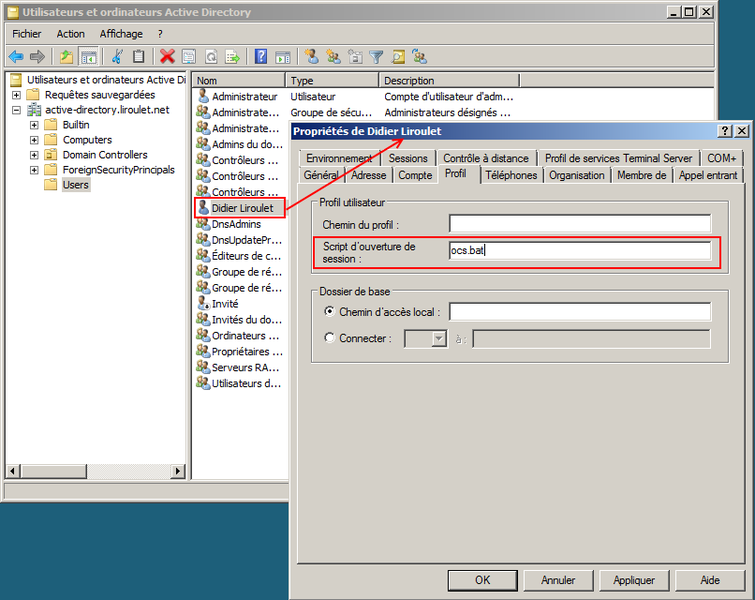

When user log in, launcher will set up and/or launch OCS Inventory NG Agent.

## Using PSEXEC or "OCS Inventory NG Agent Deployment Tool" to push OCS Inventory NG Agent

PSEXEC from Microsoft (
[https://technet.microsoft.com/fr-fr/sysinternals/psexec](https://technet.microsoft.com/fr-fr/sysinternals/psexec)
) is a great and fast way to install the OCS agents on all Windows computers, you can literally setup most
of your computers in a few hours (assuming they are all connected to the network, that is).

**`Note`**`: We've created a graphical tool for Windows, OCS Inventory NG Agent Deployment Tool, which allows
you to use PSEXEC more easily. It is able to push agent's installation on up to 10 computers simultaneously,
and also to copy the certificate used to authenticate deployment server in OCS Inventory NG data folder.`

Some tips:

PSEXEC is best used together with Domain Logon scripts or Active Directory GPO:

1. Use the PSEXEC to install on all computers that are currently connected to the network
(best used during business hours).
2. Then add a logon script/GPO as described above to install on computers that were offline the next time
they connect to the network.
3. If you really don't want to use logon script/GPO, you can create and monitor a response file to get
a list of computers that were not deployed for any reason, and then rerun PSEXEC just for these computers.

PSEXEC Usage examples:

We assume that the agent setup file is called agentsetup.exe and it was placed on a shared folder accessible to all users.

* Install silently on all computers currently logged in your domain:

        psexec \\* -s \\Server\NetLogon\OCS-NG-Windows-Agent-Setup.exe /S /NOSPLASH /SERVER=http://my_ocs_server/ocsinventory

* Install silently on a single computer:

        psexec \\COMPUTER_NAME -s \\Server\NetLogon\OCS-NG-Windows-Agent-Setup.exe /S /NOSPLASH /SERVER=http://my_ocs_server/ocsinventory

* Install silently on all computers using the domain administrator credentials:

        psexec \\* -s -u Domain\Administrator -p Password \\Server\NetLogon\OCS-NG-Windows-Agent-Setup.exe /S /NOSPLASH /SERVER=http://my_ocs_server/ocsinventory

* Install silently on specific computers (ALL.TXT is a text file that lists target computer names, one per line), using domain administrator credentials:

        psexec @ALL.TXT -s -u Domain\Administrator -p Password \\Server\NetLogon\OCS-NG-Windows-Agent-Setup.exe /S /NOSPLASH /SERVER=http://my_ocs_server/ocsinventory

## Generating inventory of a non network connected Windows computer

Run “OCS-NG-Windows-Agent-Setup.exe” on client computer, from an USB stick for example...

..and click “Next” button.

Validate license agreement by clicking “I agree” button.

Select **Local inventory** installation type.

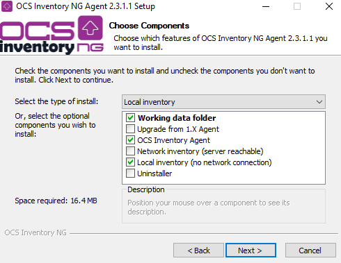

By default, OCS Inventory Agent writes only few lines in the log files. You may increase this enabling
“Verbose log”. You may also specify the TAG value. Last, indicate the folder where you want to store
generated inventory file, your usb stick for example:

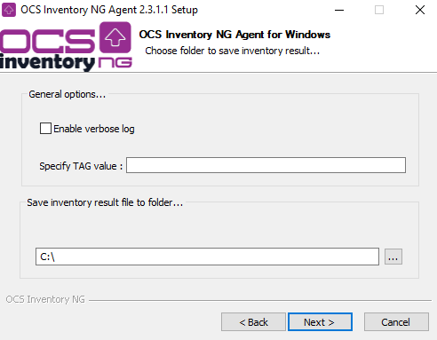

In local inventory mode, Agent will be installed into a temporary folder
(we recommend not changing this folder, it will be automatically deleted at the end of process),
Click “Install” button to start process. Agent is installed into temporary folder, launched to generate
a ".ocs" inventory file stored in the folder you've specified, and then removed from computer.

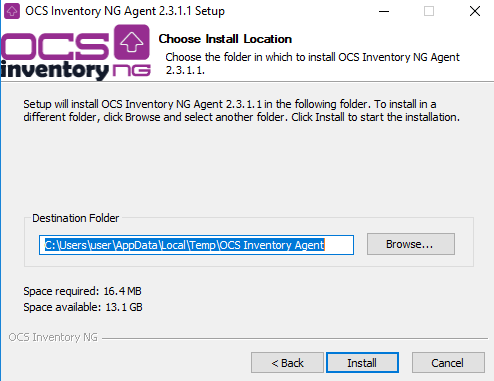

Click “Finish” button to close OCS inventory NG Agent Setup.

This is the interactive process, but it can be scripted using **/LOCAL=path_to_folder_where_to_store_ocs_file**
command line switch.

For example, you can use **OCS-NG-Windows-Agent-Setup.exe /S /LOCAL=C:\\** to silently generate
".ocs" inventory file into folder c:\.

Once you've transfered generated inventory file, you will be able to import it into the inventory
database of OCS Inventory NG Server, through the Administration Console.

## OCS Inventory NG Agent for Windows command line options

OCS Inventory NG Agent version 2.0 or higher includes some command line switches to allow detecting errors.

Once agent is installed, you can run it manually to diagnose problems. Use “C:\Program Files\OCS Inventory
Agent\OCSInventory.exe [options]” command line where [options] may be in the following command line switches.

**Command Line Options** | **Meaning**
------|------
**/work_dir="path to directory"** | Agent must use "path to directory" as working dir (this directory may included configuration file). Default is "%ALLUSERSPROFILE%\Application Data\OCS Inventory NG\Agent" or "%PROGRAMDATA%\OCS Inventory NG\Agent"
**/local[="path to folder"]** | Agent do not contact communication server, and store inventory in xml compressed .ocs file into folder "path to folder". If no "path to folder" provided, agent assume folder as data folder</nowiki>
**/debug[=level]** | Generate a very verbose log file "ocsinventory.log" into agent's install folder.  0 => disable verbose logs (default)  1 => enable default verbose logs (default when no level provided provided)  2 => enable debuging logs
**/notag** | Agent must NOT prompt user for TAG in any case
**/tag="my value"** | Agent must set "my value" as TAG value
**/xml=["path to folder"]** | Agent must store inventory in uncompressed xml format into folder "path to folder". If no "path to folder" provided, agent assume folder as data folder
**/force** | Always send inventory, even if server do not ask for it (use only for debugging purpose !)
**/ipdisc="network number"** | Agent must launch IP discovery on network "network number" (use only for debugging purpose !)
**/ipdisc_lat="number of milliseconds"** | Set latency between 2 IP Discover requests to "number of milliseconds"
**/fastip** | Never wait for latency between 2 IP Discover requests (use only for debugging purpose !)
**/hkcu** | Search also for software under HKEY_CURRENT_USER registry hive (do not work with service as LocalSystem !)
**/uid** | Agent must generate a new unique device ID
**/server=http[s]://server.domain.tld[:port]/ocsinventory** | Agent try to connect to Communication Server address and port Listening on http[s]://server.domain.tld[:port]/ocsinventory
**/ssl=0/1** | When usng SSL connections: 0 => SSL without certificate validation   1 => SSL with server certificate validation required (needs CA certificate)
**/ca="path_to_cabundle.pem"** | Path to CA certificate chain file in PEM format, for server certificate validation
**/user=username /pwd=password** | Communication Server authentication credentials
**/proxy_type=0/1/2/3** | Agent proxy  use 0 => no  1 => HTTP proxy  2 => Socks 4 proxy  3 => Socks 5 proxy
**/proxy=proxy_address** | Proxy server address (without protocol !)
**/proxy_port=port** | Proxy server port
**/proxy_user=username** | Proxy authentication credentials
**/proxy_pwd=password** | Proxy authentication credentials
**/D=/<directory installation>** | specify the directory where your want to install ocsinventory agent (default %PROGRAMFILES%\ocs inventory agent)

## Sample configuration file "ocsinventory.ini"

    [OCS Inventory Agent]
    ; OCS Inventory NG Agent features
    ; Enable debugging mode (0 => disabled, 1 => enabled, 2=> trace all)
    Debug=1
    ; Enable local inventory mode (path to folder to store .ocs file => enabled,
    ; empty => disabled)
    Local=
    ; Enable agent scanning HKEY_CURRENT_USER hive for printers and sofware
    ; (0 => disabled, 1 => enabled)
    HKCU=0
    ; Disable prompting user for TAG value (0 => prompt allowed, 1 => disabled)
    NoTAG=0
    ; Force agent launching IpDiscover on specified network (network address => enabled,
    ; empty disabled)
    IpDisc=
    ; Which communication provider to use
    ; Name of communication DLL and configuration section to use
    ; DLL must be in "com" sub directory
    ComProvider=ComHTTP.dll

    [HTTP]
    ; OCS Inventory NG Communication Server address and port
    ; Listening on http[s]://server[:port]/ocsinventory
    Server=http://localhost/ocsinventory
    ; Using SSL connections (0 => SSL without certificate validation,
    ; 1 => SSL with server certificate validation required)
    SSL=0
    ; Path to CA certificate chain file in PEM format, for server certificate
    ; validation
    CaBundle=D:\Developp\OCS Inventory NG\cacert.pem
    ; Using authentication on Communication Server (0 => no, 1 => yes)
    AuthRequired=0
    ; Communication Server authentication credentials (encrypted)
    User=
    Pwd=
    ; Using proxy (0 => no, 1 => HTTP proxy, 2 => Socks 4 proxy, 3 => Socks 5 proxy)
    ProxyType=0
    ; Proxy address and port
    Proxy=
    ProxyPort=
    ; Using proxy authentication (0 => no, 1 => yes)
    ProxyAuthRequired=
    ; Proxy authentication credentials (encrypted)
    ProxyUser=
    ProxyPwd=

    [OCS Inventory Service]
    ; Time to wait in minutes before next agent start
    TTO_WAIT=1020
    ; Number of hour between 2 agent runs
    PROLOG_FREQ=5
    ; Old value of PROLOG_FREQ
    OLD_PROLOG_FREQ=10
