# OCS MacOSX agent 2.X documentation

## Installing OCS MacOSX agent 2.X

**`Note: OCS MacOSX agent 2.3 and newer agent are fully compatible under MacOSX 10.11 El captain and more.
For older macos system you will have to user older versions of our agent. We don't support Mac OS versions that are not maintained by Apple`**

Download OCS MacOSX agent from OCS Inventory NG website download page(
[http://www.ocsinventory-ng.org/en/#home-en](http://www.ocsinventory-ng.org/en/#home-en)
), unzip the file and double click "Ocsinventory_Agent_MacOSX.pkg".

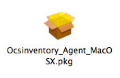

Click "Continue".

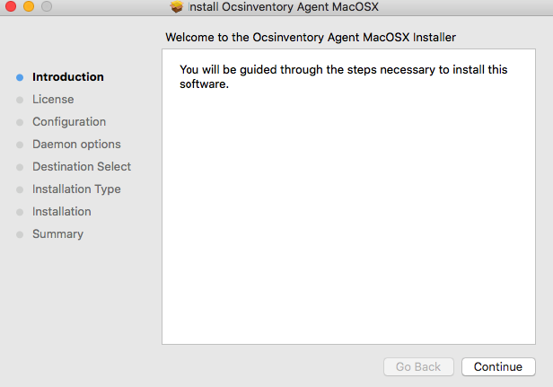

Validate license agreement by clicking "Continue" and "Agree".

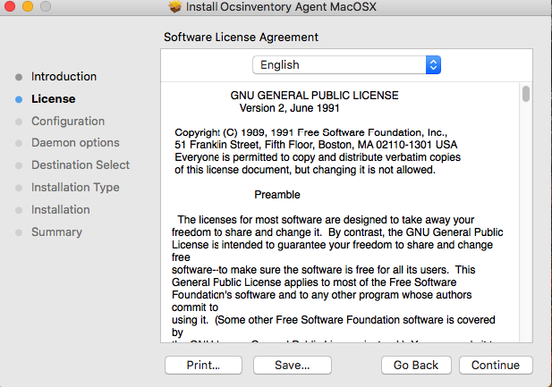

If you already made an OCS MacOSX agent installation, you may be asked if you want to launch
OCS MacOSX configuration. Click on "Yes" to launch configuration panel or "No" to skip this step.

**`Warning: message=If you click on "Yes", /etc/ocsinventory-agent/ocsinventory-agent.cfg
file content will be erased !`**

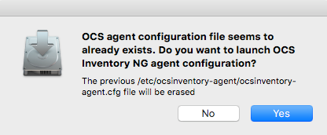

Set your OCS MacOSX agent configuration by choosing several options:
* Http or https for MacOSX agent communication to OCS server ("http" by default).
* OCS server server name ("ocsinventory-ng" by default).
* MacOSX agent TAG value (optional).
* Log file path for OCS MacOSX agent ("/var/log/ocsng.log" by default).
* Activate or Unactivate OCS MacOSX agent debug mode for logs (activated by default).
* Activate or Unactivate OCS MacOSX agent packages download feature (activated by default).
* Activate or Unactivate OCS MacOSX agent SSL certificate feature (activated by default).
* Certificate file path (mandatory if you activate OCS MacOSX agent packages download feature). Certificate file must be named as "cacert.pem".

Click on "Continue" to validate configuration.

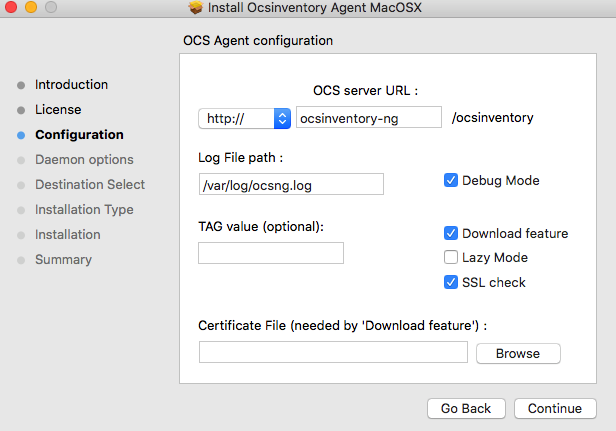

If you activate OCS MacOSX agent packages download feature and SSL feature without specifying a certificate file path, you may have this warning.

**`Warning: message=If you activate OCS MacOSX agent packages download feature without specifying a
certificate file path, OCS MacOSX agent packages download feature won't work !!!`**

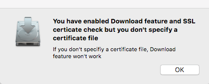

Set how OCS MacOSX agent will be launched by MacOSX Launchd daemon by choosing several options:
* Periodicity for OCS MacOSX agent to be launched by Launchd daemon (5 hours by default).
* Activate or Unactivate OCS MacOSX agent launch at Launchd daemon start (activated by default).
* Activate or Unactivate OCS MacOSX agent launch, using Launchd daemon, after installation (inactivated by default)

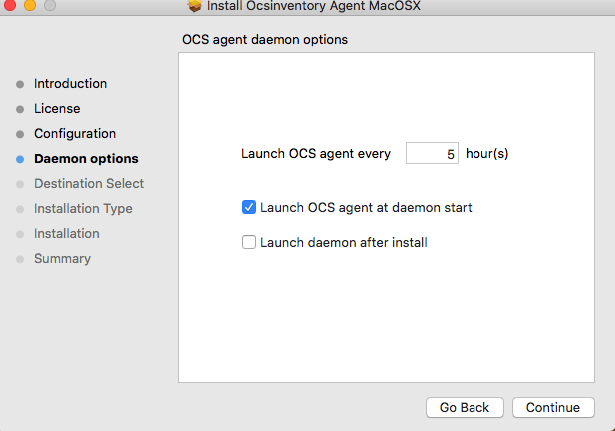

Select hard drive where you want to install OCS MacOSX agent and click "Continue".

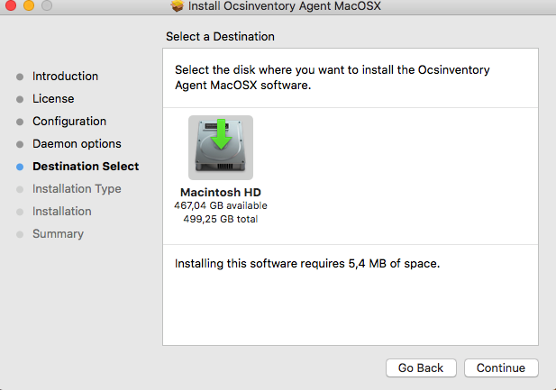

Click "Install".

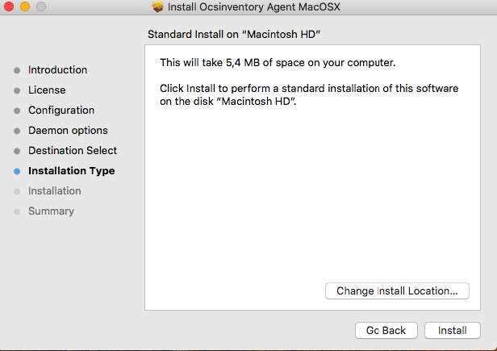

Click "Close" to end installation.

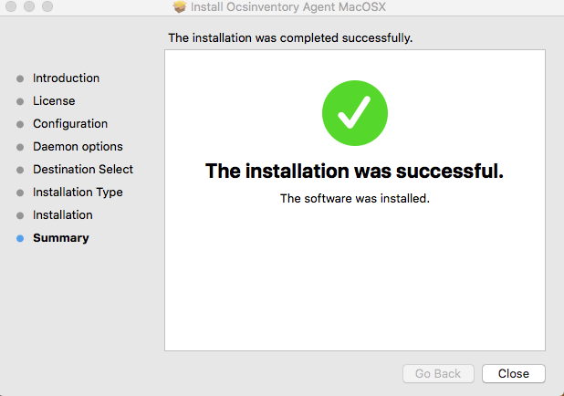

## Launch MacOSX agent

To launch MacOSX agent, open a new Finder window, go to _Applications_ and then double click on _OCSNG.app_.

A new window appears and click _Yes_ to launch agent or _No_ to cancel.

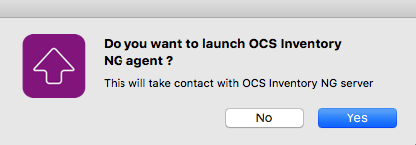

During agent launch you will see an icon in your Dock and this will disappear when agent launch will be ended.
