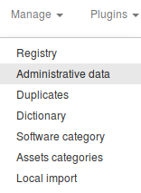

## Introduction

Complex administrative data have been added in 2.0 release of OCS inventory NG. This feature allow
you to simply add informations to machines or SNMP devices.

Once this information added, it is present throughout the OCS web interface (multicriteria search,
columns in tables). By default, just one data exists : TAG. This field is modifiable but not deletable.

## Configuration of management console

Click on _Manage_ then _Administrative data_.

The table displays existing data.

Administratives data _Computer_ or _SNMP_ are managed in the same way. First will be available at the
Machine details, and the second will be visible on the details of an SNMP device.

## Add an administrative data category

Your data will be divided into different categories that you will define. To do this, click on the plus,
on field 

A popup is then displayed and will allow you to manage your administrative data categories.

You can modify/delete/add categories.

Now, you can create you own administrative data by categories.

## Different types of administrative data

You can create different data types : text, checkbox, button, textarea, **QR code**, etc. For exemple,
we have created following administrative data :

Going into the details of a machine, we find all these fields.

## Add data to administrative data with multivalues

If you have created administrative data such as checkbox, select or radiobutton, you'll need to enter
values for these fields. To do this, go to machine details. Click on
 to _edit_ mode. You will find in each multivalued field
this icon . It will allow you to enter your data ..
You'll also notice that icons 
will allow you to organize your fields to display.

To exit to edit mode, click on , top right.

For example, here's what you might have:

So each of your machines will have, in the _Machine details_, all fields you have created.

These fields will also be present in some tables (_All machines_ for example), but also in the
multicriteria search. This will allow you to perform batch processing of your administrative data.
