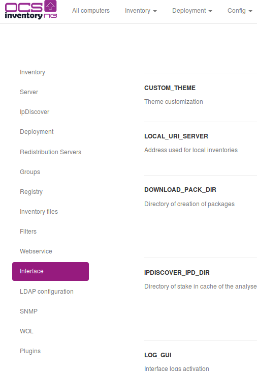
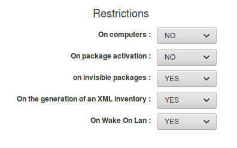
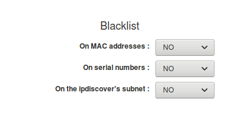
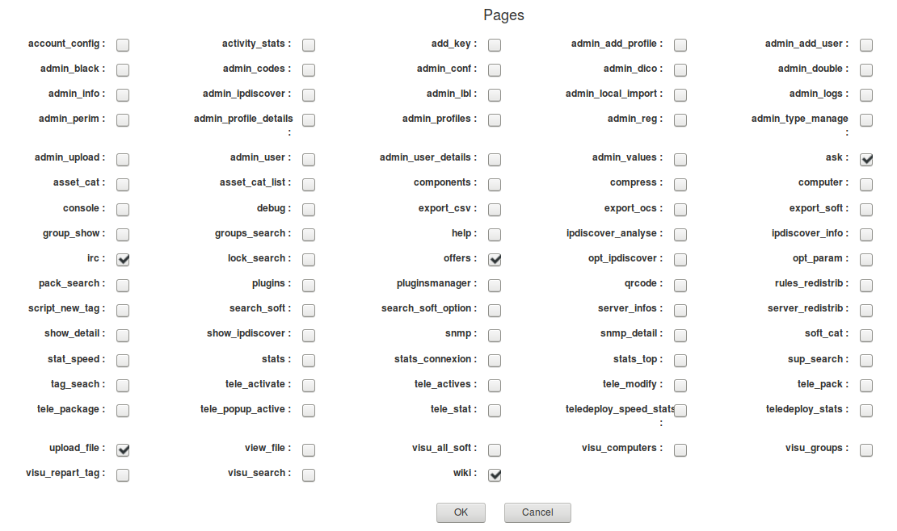
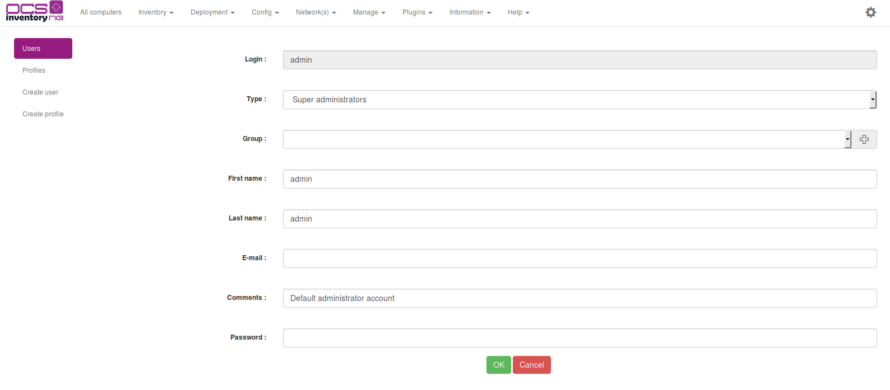

# Profiles administration of the administration interface

Profiles of the web interface in OCS 2.0 are handled as files. They are storage by default in

    ocsreports/plugins/main_sections/conf

All changes made to a profile cause a backup of the original file. This backup is stored by default in

    ocsreports/plugins/main_sections/conf/old_conf

You can choose to store these files elsewhere by going to _Config_ then click on _Config_ and _Interface_ tab.

and modify options

## Profiles Management

### **Create a profile**

Click on Create Profile at the left of the page, enter your informations and click on OK.

### **Access to profile's edition**

Click on Profile at the left of the page and you can access to the different profiles which exist.

You can click on the cross in the column "actions" to delete a profile or on the profile you want to edit.

Now you can do many things.

#### **Management of the profile restriction**

Description of options :

* Restrictions on computers : Define if the visibility of Computers is restricted only to a specific
selected group by TAG. You have to coiche user , add a set of strings that may contain ? or * and
that match the TAG of computers would be visible to that user.

* Restrictions on the packets activation : Define if the profile has the right to activate a package.

* Restrictions on invisible packages :

* Restrictions on the generation of an XML inventory :

* Restrictions on Wake On Lan :

#### **Profile permissions on the blacklist**

Description of options :

**`Note: the blacklisting of serial numbers and MAC addresses is useful for the management
of duplicate machines.`**

* _Rights to blacklist on MAC addresses_ : Fix the right to the profile to blacklist serial numbers
of network cards of machines. If the profile has a restricted view on machines, it can blaclister
only addresses present on these machines.

* _Rights to blacklist on serial numbers_ : Fix the right to the profile to blacklist serial numbers of
the machines bios. If the profile has a restricted view on machines, it can blaclister only numbers
present on these machines.

* _Rights to blacklist on ipdiscover's subnet_ : Fix the right to the profile to blacklist sub-nets
for ipdiscover. Sub-nets blacklisted enter in category _blacklist_ in ipdiscover section.

#### **Administration rights of the profile**

Description of options :

* Manage ipdiscover : Allows the profile to modify networks ipdiscover.

* Manage teledeploy : gives the right to a profile to affect package on machines or groups.

* Update Configuration : gives the right to a profile to modify personnal configuration of a machine or a group.

* Manage groups : gives the right to a profile to manage groups of machines.
Create/delete/modify & group, insert machines in groups.

* Manage console : gives the right to a profile to manage the home page. It will be possible to modify
calculs parameters, add information, and add message.

* See warning messages of the GUI : define if the profile will see warning messages and / or security,
administration messages. It will concern for example the presence message of install.php file,
write access to certain directories, ...

* Manage accounts info : define if the profile has right to add data types in administratives data
as in drop-down menus, checkbox, radiobutton, ... It will allow also to modify the order of differents data.

* may change accounts info computer : define if the profile has right to modify administratives data
of its machines.

* may change their membership group : this option is used only for teledeploy workflow. It will allow
or not to change its profile group (in the configuration section of the account).

* Manage profiles : define if the profile will be able to manage users profiles.

* Manage profiles group : this option is used only for teledeploy workflow. It will allows the profile
to create or delete users groups of teledeploy workflow.

* Manage SNMP communities : gives the profile the ability to add/delete/modify SNMP communities.

* Delete his computers : gives right to remove its machine from inventory.

#### **Access rights to differents pages of a profile**

Description of pages :

* about :
* account_config :
* activity_stats : jpgraph chart in the statistics section
* add_key :
* admin_add_profile : page to add a new profile
* admin_add_user :
* admin_black : administration page blacklists of serial / macadresse / networks
* admin_codes : allocation page of machines by TAG
* admin_conf :
* admin_dico : Dictionaries page
* admin_double : Duplication page
* admin_info : configuration page of the administrative data Doc gui user18.jpg
* admin_ipdiscover : administration page of the ipdiscover
* admin_lbl :
* admin_local_import : Local imports page
* admin_logs : Logs page
* admin_perim :
* admin_profile_details :
* admin_profiles : administration page of profiles
* admin_reg :
* admin_type_manage :
* admin_upload :
* admin_user :
* admin_user_details :
* admin_values :
* ask :
* components :
* compress : page allows to retrieve package fragments
* computer : main page of machine details
* console : home page
* debug : page allows access to debug
* export_csv : csv export page of data tables
* export_ocs :
* export_soft :
* forums :
* group_show :
* groups_search :
* help : Help page
* ipdiscover_analyse :
* ipdiscover_info :
* irc :
* lock_search :
* offers :
* opt_ipdiscover :
* opt_param :
* pack_search :
* plugins :
* pluginsmanager :
* qrcode :
* rules_redistrib :
* script_new_tag :
* search_soft :
* search_soft_option :
* server_infos :
* server_redistrib :
* show_detail :
* show_ipdiscover :
* snmp : page of devices detected by SNMP
* snmp_detail : main page of SNMP devices details
* stat_speed : main display page of teledeployment speed
* stats : statistics page
* stats_connexion :
* stats_top :
* sup_search :
* tag_seach :
* tele_activate : package activation pagepackage activation page
* tele_actives :
* tele_modify :
* tele_pack :
* tele_package :
* tele_popup_active :
* tele_stat :
* teledeploy_speed_stats : jpgraph chart in the statistics section of package deployment rate
* teledeploy_stats : jpgraph chart on the rate of package deployment
* upload_file :
* view_file :
* visu_all_soft :
* visu_computers :
* visu_groups :
* visu_repart_tag :
* visu_search :
* wiki :

## **Users Management**

### **Create an user**

Click on Create User at the left of the page, enter your informations and click on OK.

### **Access to User's edition**

Click on User at the left of the page and you can access to the different profiles which exist.

You can click on the cross in the column "actions" to delete an user or on the user you want to update.

#### **Update an user**

For update an user, enter the informations and click on OK.

You can add a group to the list of the groups with this icon .
