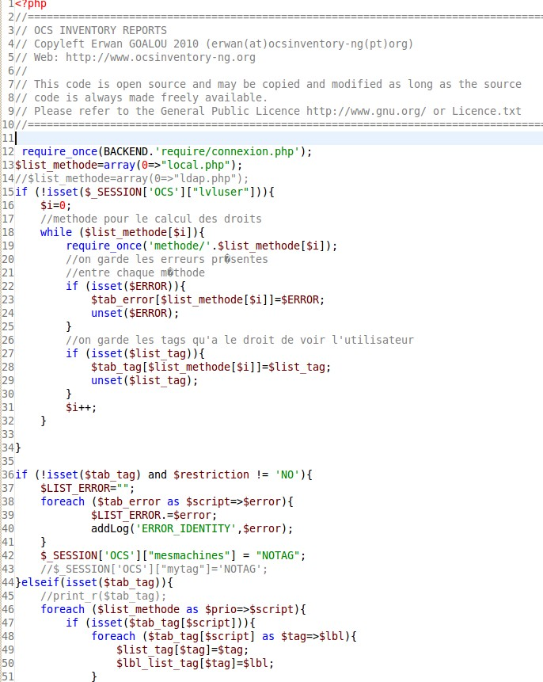

# Manage authentification with LDAP

It is possible to delegate authentication to the administration console of OCS Inventory NG to an annex
database. Some modules have already been developed and are available natively in version 2.0. So we will
see how to delegate the connection to the OCSInventory NG GUI to LDAP.

**`Note: For this documentation, we assume that you have a working and fully configured LDAP server`**

## Preperations
For the LDAP connection we need the php_ldap module:
``` 
apt install php-ldap
```
For debian based unix

## Configuration options in web gui
Open the dropdown "Config" choose "Config" and then click on "LDAP configuration".

Here we have varius files to fill:
+ **CONEX_LDAP_SERVEUR:** Is the LDAP Server (ex .127.0.0.1 or ldpa.acme.com)
+ **CONEX_ROOT_DN:** Is the user which is used to check logins (attribute: ...)
+ **CONEX_ROOT_PW:** Password if the user above
+ **CONEX_LDAP_PORT:** LDAP conection Port (389 or 686 for SSL)
+ **CONEX_DN_BASE_LDAP:** Is the Base DN where Users which are able to login could be found
+ **CONEX_LOGIN_FIELD:** The attribute with which a user logs in (ex. sAMAccountName or uid)
+ **CONEX_LDAP_PROTOCOL_VERSION:** Protocol version number (3 for Active Directory)
+ **CONEX_LDAP_CHECK_DEFAULT_ROLE:** Choose a default role from dropdown which all users have expect the one from Field check

Currently we can seperate users authenticated with ldap through three options: Field1, Field2 and default role. With the options below we can use an attribute to assigen the users to a differnt group than the default group.
+ **CONEX_LDAP_CHECK_FIELD1_NAME:** An attribute which has every user (ex. department)
+ **CONEX_LDAP_CHECK_FIELD1_VALUE:** A value of the attribute above 
+ **CONEX_LDAP_CHECK_FIELD1_ROLE:** Choose a role from dropdown


## Modification of configurations in file system
Typical the files are stored under: ```/usr/share/ocsinventory-reports/ocsreports/backend/AUTH```
We have to change two files: In the first (auth.php) we set the authentication method and in the other (identity.php) we define that the user rights (role) are also synchronised with ldap.

### Changes of ~/backend/AUTH/auth.php
We need to change the login option from local to ldap by comment this line out 

`$list_methode=array(0=>"local.php");`       
and the line below in        
`$list_methode=array(0=>"ldap.php");`      

It is also possible to use both, ldap and local authentication:                
`$list_methode=array(0=>"ldap.php",1=>"local.php");`    

### Changes of ~/backend/identity/identity.php
We need to delegate the rights of the account also to ldap by commenting this line out

`$list_methode=array(0=>"local.php");`      
and this line below in      
`$list_methode=array(0=>"ldap.php");`     

If you use local and ldap authentication you need to use this line:

`$list_methode=array(0=>"ldap.php",1=>"local.php");`

In this case, rights will be retrieve in the LDAP, and will be completed by those found locally.


## Modification of connection form
Changes need to be done in ~/backend/AUTH/auth.php
It is possble to change the connction form from the classic html site to a browser query

If you don't modify the line

    $affich_method='HTML';

then you will keep the "classic " login page.


However, if you replace **html** by **SSO**

    $affich_method='SSO';

the request for _username / password_ will be in this form


**`Note: In this case, the choice of language will no longer directly available.
You will need to choose it and freeze it in the var.php file.`**

## Modification of backend/identity/identity.php file



This file allow to define rights that the account logged will have into the administration console of
OCS Inventory NG. In order to delegate those rights to a schedule base, in our case an LDAP,
you have to change the line

    $list_methode=array(0=>"local.php");

by

    $list_methode=array(0=>"ldap.php");

It is also possible to keep the 2 ways to connect to the administration console by changing the line

    $list_methode=array(0=>"ldap.php",1=>"local.php");

In this case, rights will be retrieve in the LDAP, and will be completed by those found locally.

## Exemple & practice

Based on the LDAP database created at the beginning, and having made changes outlined in
preceding paragraphs, so we can connect with the user **john/password**.


On connection, he will have automatically rights of **Super administrator** profile.

His account will be created directly in the _ocsweb_ database LDAP information. His Password will
not be stored.


However, the user **georgess**, may well identify but cannot connect directly. Indeed, we have assigned by
default a **Local Administrator** profile, which has a limited view of the park of machines.
So, after the connection of that user, it will have the following message:


For that user can access the administration console of OCS Inventory NG, it will wait a
**Super Administrator** gives it access to TAG wich interested it.

