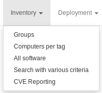

# CVE Reporting

CVE Reporting has ben added in release 2.x of OCS Inventory. 
By enabling this feature, OCS Inventory can automatically query a 
[cve-search](http://cve-search.github.io/cve-search/) server for 
vulnerabilities that may apply to your inventoried softwares.

**`Warning : CVE Reporting is a feature for informational purposes. OCS Inventory does not guarantee the accuracy of the informations provided.`**

## Configuring the CVE-Search management

As administrator, go to the menu ```Configuration > General configuration```, 
and click on the "CVE-search management" entry in the left navigation pane:


There are 3 settings :
+ **VULN_CVESEARCH_ENABLE** : Define wether the integration is enabled or not (default : Disabled);
+ **VULN_CVESEARCH_HOST** : Define the URL of the cve-search server to be queried (You may use https://cve.circl.lu if you don't host any cve-search server).
+ **VULN_BAN_LIST** : Select software categories that you do not want to process.


## Configure CronTab

In your server, configure a CronTab to call the file cron_cve.php in

    ocsreports/crontab/cron_cve.php

To clean CVE, configure a CronTab to call the file cron_clean_cve.php

    ocsreports/crontab/cron_clean_cve.php

**`Note`**`: It's recommended to execute the crontab at night`

## Features

When CVE-Search has been enabled and crontab cron_cve.php has been executed, click on ```Inventory > CVE Reporting ```.  



CVE Reporting displays all CVE in association with software and their versions already inventoried by OCS Inventory. Here are the different information displayed :

+ Publisher
+ Software name
+ Concerned software version
+ CVSS (vulnerability score)
+ CVE Id
+ Link to CVE reference (only the first reference has been inventoried by OCS Inventory)


You can display all CVE or click on left navigation pane to see CVE by vulnerability score.