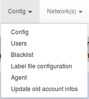
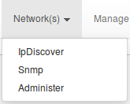
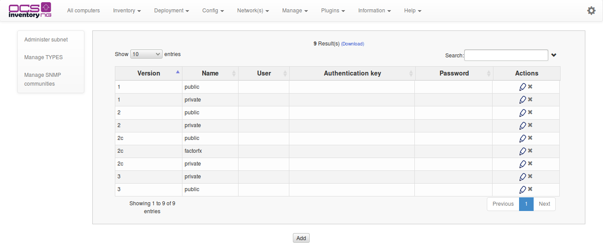
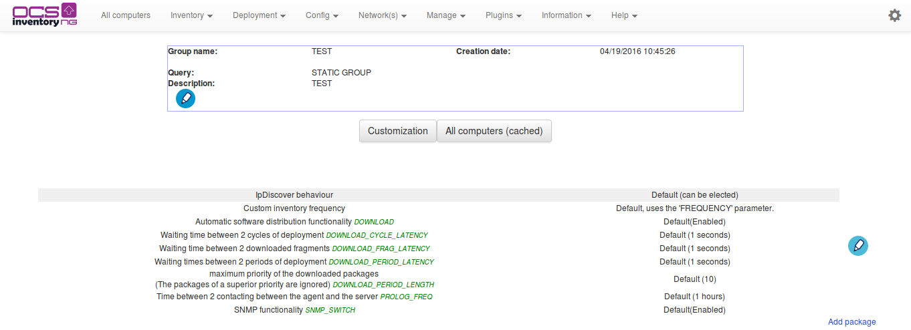
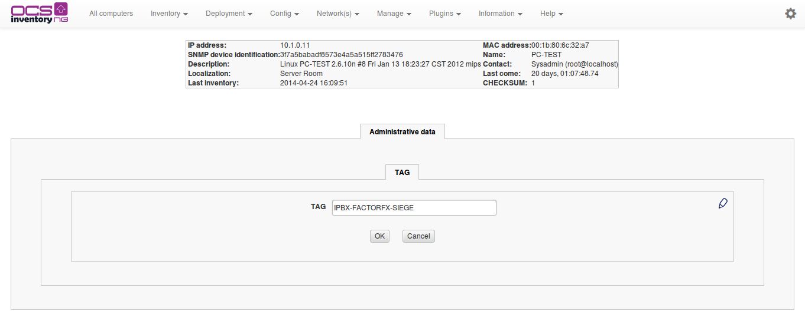

# Using SNMP scans features

**`Warning: This feature works ONLY with Unix Unified Agent. It will be integrate for Windows Agent
in OCS Inventory NG 3.0.`**

## How does it works ?

Since version 2.0, OCS Inventory NG integrates SNMP scans feature. The main goal of the SNMP integration
in OCS Inventory NG is to enhance data collected by Ipdiscover. Using SNMP scans, you will be able
to get a lot of informations about network devices : printers, switches, computers (which don't have
an OCS agent), etc... SNMP scans will be made by OCS agents using IP addresses collected by Ipdiscover.
These IP addresses to scan are directly sent to OCS agent by OCS server when OCS agents take contact
(PROLOG step).

You can find more information about Ipdiscover
[here](../../05.Network-Discovery-with-OCS-Inventory-NG/Using-IP-discovery-feature.md).

**`Warning: An OCS agent MUST BE Ipdiscover elected (or forced manually) to be able to make SNMP scans.`**

**`Warning: Since OCS Inventory 2.0.3, you MUST set OCS server address in
/etc/ocsinventory-agent/ocsinventory-agnet.cfg to use
`[_`https://your_ocs_server/ocsinventory`_](https://your_ocs_server/ocsinventory)`
instead of`[_`http://your_ocs_server/ocsinventory`_](http://your_ocs_server/ocsinventory)`.
If not, OCS agent won't receive SNMP scans orders from OCS server.`**

SNMP scanning step by step :

1. an OCS agent is Ipdiscover elected or Ipdiscover forced manually
2. the agent takes contact to the server (PROLOG) and do its Ipdiscover network scan
3. OCS agent send back the data collected (using Ipdiscover) to OCS server (IP addresses,
MAC addresses, hostnames etc...)
4. during the next contact to OCS server, OCS agent received from server the IP addresses to scan
using SNMP (this IP addresses are get using previous Ipdiscover data sent back by OCS agent)
and retrieve SNMP communities information from database
5. OCS agent do its Ipdiscover scan (because it is Ipdscover elected anyway) and sent back data collected
to OCS server
6. OCS agent make SNMP scans using IP addresses received from server and SNMP communities
7. OCS agent sent back the SNMP data collected to the server

Once all theses steps are done, you will be able to view SNMP scans results using OCS Web Interface.
You will be able to enable or disable SNMP scan features in Web Interface using global configuration
or using computer or groups custom parameters, and will be able to add your own SNMP communities in
Web Interface too.

## Configuration using Web Interface

### **General options**

To manage SNMP general options in Web Interface, go to Config menu, click on _Config_ and
go to the _SNMP_ tab.

This is the SNMP configuration options available:

* **SNMP**: activate or deactivate SNMP scan feature. If this option is _OFF_, no SNMP scans will
be made by any OCS agent
* **SNMP_INVENTORY_DIFF**: use SNMP Inventory diff feature to lighten your DB backend. SNMP inventory
data will be written in database only if it changes. OCS server will use _snmp_laststate_ table
to make this comparison

### **Manage SNMP communities**

To be able to scan a SNMP device, you must use SNMP community. SNMP community can be viewed as
authentication informations to be allowed to scan SNMP devices. SNMP community is created by 2 informations:

* SNMP version : it is the SNMP version supported by the SNMP device(s) (can be version 1, version 2,
version 2c etc...)
* SNMP community name : it is the community name you set in your SNMP device(s). For many SNMP devices,
the default SNMP community name is public.

**`Note: In OCS Inventory NG 2.0, only SNMp v1, v2 and v2c are supported. SNMp v3 will be supported
in future releases.`**

If you set your own SNMP communities in your SNMP devices, you have to add it in OCS Inventory
configuration. OCS agent will received informations about this communities and will try to scans SNMP
devices using every SNMP communities you set in administration console. SNMP communites informations
are directly added in database.

To manage SNMP communities in Web Interface, go to _Network(s)_ menu, click on _Administer_ and go to
the _Manage SNMP communites_ tab.

You can now add a new SNMP communities using the _Add_ button. A new screen is displayed:

You have to set a community name and a SNMP version (using the drop list)

* To delete a SNMP community, click on the red cross
* To modify a SNMP community, click on the pencil

### **Configuring custom parameters**

To make an OCS agent to scan its network using SNMP (without waiting for an Ipdiscover automatic election),
you may have to set its custom parameters at computer side or at groups side.

#### **Configuring computer custom parameters**

To make a single OCS agent to scan its network using SNMP, you have to set it in its custom parameters.
First, go to its _Configuration_'s page and click on the _pencil_. Then, click on the _Networks scans_ tab.

**`Note: Since OCS Inventory NG 2.1, you can scan remote networks (others that where the agent is located)`**

* If no network address appears in **IPDISCOVER** option, you have to set it manually using the drop list
* You can enable/disable a computer to make SNMP scans using **SNMP_SWITCH** option. By default,
global configuration parameter is taken, corresponding to the Default radio button.

Click on the _Update_ button to save your modifications.

#### **Configuring groups custom parameters**

To make a single OCS agent to scan its network using SNMP, you have to set it in its custom parameters.
First, go to the _groups_ page in _Inventory_, click on _Customization_, and then click on the _pencil_.
Then, click on the _Networks scans_ tab.

For more informations about groups page, click
[here](../../03.Management-console-and-its-advanced-features/Using-computers-groups.md)

* If no network address appears in **IPDISCOVER** option, you have to set it manually using the drop list
* You can enable/disable a computer to make SNMP scans using **SNMP_SWITCH** option. By default,
global configuration parameter is taken, corresponding to the Default radio button.

Click on the _Update_ button to save your modifications.

## Configuring Unix Unified Agent

### **Prerequisites**

To be able to make SNMP using OCS Unified Unix agent, you have to install Net::SNMP perl module
(see [http://search.cpan.org/~dtown/Net-SNMP-v6.0.1/lib/Net/SNMP.pm](http://search.cpan.org/~dtown/Net-SNMP-v6.0.1/lib/Net/SNMP.pm)).

To install it, use your distribution or OS packages as much as possible. For Debian like distributions,
install _libnet-snmp-perl_ package and for Redhat like distributions, install _perl-Net-SNMP_

If you cannot use packages, install _Net::SNMP_ perl module using CPAN like this:

    #cpan
    cpan>install Net::SNMP

### **Activate Snmp.pm**

SNMP scans feature is managed by _Snmp.pm_ Unix Unified agent module. You have two ways to activate it
in your Unix Unified agent installation:

* By using post installation interactive script by answering 'y' this question:

      Do you want to use OCS-Inventory SNMP scans feature ?

* By editing _/etc/ocsinventory-agent/modules.conf_ file and uncomment this line :

      use Ocsinventory::Agent::Modules::Snmp;

To be sure that _Snmp.pm_ will be launched when Unix Unified agent will run, you can type using command:

    #perl /etc/ocsinventory-agent/modules.conf

If no errors are displayed on stdout, this means that you have no errors.

### **Copying SSL certificate file**

To allow Unix Unified agent to download snmp_com.txt file using HTTPS, you have to copy SSL certificate file
(as cacert.pem) in your OCS server configuration directory in your basevardir directory.

**`Note: basevardir directory is the path specified in your /etc/ocsinventory-agent/ocsinventory-agent.cfg
using basevardir= parameter.`**

Your OCS server configuration directory is a directory created automatically using your OCS server URL
(http:__ocsinventory-ng_ocsinventory for example).

For example, if your basevardir parameter is _/var/lib/ocsinventory-agent/_ and your OCS server URL
is [_http://ocsinventory-ng/ocsinventory_](http://ocsinventory-ng/ocsinventory),
so you have to copy your cacert.pem certificate file in
/var/lib/ocsinventory-agent/http:__ocsinventory-ng_ocsinventory directory.

**`Note: If you already use a SSL certificate for OCS packages deployment, you may not have to copy a
new one for SNMP scans feature. Indeed, if you use the same HTTPS server for OCS package deployment
and snmp_com.txt file download, cacert.pem file will be same one in the same directory.`**

### **Scans informations using debug mode**

To see more informations about SNMP scans, you can launch _ocsinventory-agent_ using debug mode, like this :

    #ocsinventory-agent --debug

You will see an debug output about SNMP scans like this:

    [Sun Jan  9 19:40:56 2011][debug] [snmp] Scanning 192.168.11.4 device
    [Sun Jan  9 19:40:56 2011][debug] [snmp] Running HP (11) MIB module
    [Sun Jan  9 19:40:56 2011][debug] [snmp] Running If MIB module
    [Sun Jan  9 19:40:56 2011][debug] [snmp] Running Printer MIB module
    [Sun Jan  9 19:40:57 2011][debug] [snmp] Scanning 192.168.11.2 device
    [Sun Jan  9 19:41:09 2011][info] [snmp] No more SNMP device to scan
    [Sun Jan  9 19:41:09 2011][debug] sending XML
    [Sun Jan  9 19:41:09 2011][debug] sending: <?xml version="1.0" encoding="UTF-8"?>
    <REQUEST>
      <CONTENT>
        <DEVICE>
          <CARTRIDGES>
            <COLOR></COLOR>
            <DESCRIPTION>Cartouche d'encre</DESCRIPTION>
            <LEVEL>147</LEVEL>
            <MAXCAPACITY>500</MAXCAPACITY>
            <TYPE>toner</TYPE>
          </CARTRIDGES>
          <COMMON>
            <CONTACT></CONTACT>
            <DESCRIPTION>HP ETHERNET MULTI-ENVIRONMENT,ROM V.29.11,JETDIRECT,JD115,EEPROM V.29.13,CIDATE 08/11/2005</DESCRIPTION>
            <IPADDR>192.168.11.4</IPADDR>
            <LOCATION></LOCATION>
            <MACADDR>00:11:0a:f6:85:02</MACADDR>
            <NAME>HPPRINTER1</NAME>
            <SNMPDEVICEID>07af1c5aad323d941bc27e5d7ca4a936</SNMPDEVICEID>
            <TYPE>Printer</TYPE>
            <UPTIME>8 days, 20:36:47.10</UPTIME>
          </COMMON>
          <PRINTERS>
            <COUNTER>11771 impressions</COUNTER>
            <ERRORSTATE></ERRORSTATE>
            <NAME>HP LaserJet 2100 Series</NAME>
            <SERIALNUMBER>FRGW102336</SERIALNUMBER>
            <STATUS>idle</STATUS>
          </PRINTERS>
          <TRAYS>
            <DESCRIPTION>Bac 3</DESCRIPTION>
            <LEVEL>79</LEVEL>
            <MAXCAPACITY>250</MAXCAPACITY>
            <NAME>Tray 3</NAME>
          </TRAYS>
          <TRAYS>
            <DESCRIPTION>Bac 1</DESCRIPTION>
            <LEVEL>200</LEVEL>
            <MAXCAPACITY>100</MAXCAPACITY>
            <NAME>Tray 1</NAME>
          </TRAYS>
          <TRAYS>
            <DESCRIPTION>Bac 2</DESCRIPTION>
            <LEVEL>25</LEVEL>
            <MAXCAPACITY>250</MAXCAPACITY>
            <NAME>Tray 2</NAME>
          </TRAYS>
        </DEVICE>
      </CONTENT>
      <DEVICEID>thekid-2010-10-13-20-11-26</DEVICEID>
      <QUERY>SNMP</QUERY>
    </REQUEST>
    [Sun Jan  9 19:41:09 2011][debug] [snmp] End snmp_end_handler :)

In this example, you can see that the agent scanned a printer and the data related.

## Query SNMP inventory results

To query SNMP inventory results in Web Interface, go to in _Network(s)_ menu, and click on _SNMP_.

You will see table containing all the SNMP devices scanned by OCS agents.

### **Show SNMP device inventory**

To have more informations about a SNMP device, just click on its name to display its inventory page.

* At the bottom of the page, you have a grey frame corresponding to general information about SNMP device:
IP address, MAC address, Name, Description etc...
* At the middle of the page, you have a blue frame corresponding to special information depending on
the device type . For a printer you will have its number of impressions, its serial number,
its status etc...For a switch, you will have its type, etc...
* At the bottom of the page, you have different tabs corresponding to inventory data. For example,
you may have _Administrative data, Cartridges, Trays_ tabs. The number of tabs will depends on the data
scanned by OCS agent, so you may not have all the tabs for a SNMP device. However, you will have
the _Administrative data_ tab by default, to be able to modify administrative data on a SNMP device
(like TAG or any administrative data you created).

### **Delete a SNMP device**

* To delete a SNMP device, just click on the red cross at the right of the SNMP devices table.
* If you want to delete several SNMP devices, select it using the select box at the right of the table,
and click on the _"Remove Selected" icon a the bottom of the table_.
