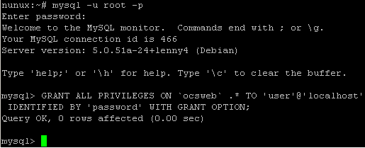
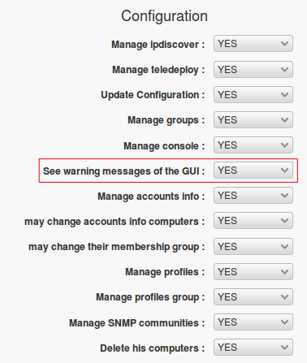

# Secure your OCS Inventory NG Server

We recommend you to secure you OCS Inventory NG Server.
Since OCS Inventory NG 2.0, warning message prevents you about a security risk in management console.

## Remove installation file

You have to remove install.php in ocsreports directory. Generally under linux in

    /usr/share/ocsinventory-reports/ocsreports/

## Secure your management console

By default, an account is created by installation script : admin / admin You have to create your own
account with Super Administrator profile, and after that remove default account. An other solution is
to change the admin account password.

## Secure mysql access

By default, installation script create a mysql user **ocs** with password **ocs**. We recommend you to change
minimum the password, but better thing is to create a new mysql user.

### **Create a new mysql user**

Connect to your mysql server

    mysql -u root -p

Create a new user: **user** with password:**password** with all privileges for ocsweb database.

    GRANT ALL PRIVILEGES ON `ocsweb` .* TO 'user'@'localhost' IDENTIFIED BY 'password' WITH GRANT OPTION;

### **Modify configuration files**

#### **dbconfig.inc.php file**

Under Linux, generally in

    /usr/share/ocsinventory-reports/ocsreports/
 

    $_SESSION["SERVEUR_SQL"]="localhost";
    $_SESSION["COMPTE_BASE"]="ocs";
    $_SESSION["PSWD_BASE"]="ocs";

#### **z-ocsinventory-server.conf file**

Under Linux, generally in

    /etc/apache2/conf.d/
 

    # User allowed to connect to database
    PerlSetEnv OCS_DB_USER user
    # Password for user
    PerlSetVar OCS_DB_PWD password

**`Warning: Don't forget to restart apache. Else, OCS Inventory NG server will return an ERROR 500 to agents
which contact it.`**

# Desactivate warning message in management console

**`Warning: We recommend you to secure your server following preceding paragraphs, but if you want,
you can desactivate warning message in GUI`**

You have to connect to management console, click on **User** icon, then on **Administer profiles** tab,
and choose the profile to modify.

Click on **Rights to manage** tab, an set **See warning messages of the GUI** to **NO**.

Finally, register modification.

For more informations about users and profile, click [here](../../03.Management-console-and-its-advanced-features/Managing-users-profiles-of-the-web-interface.md).
