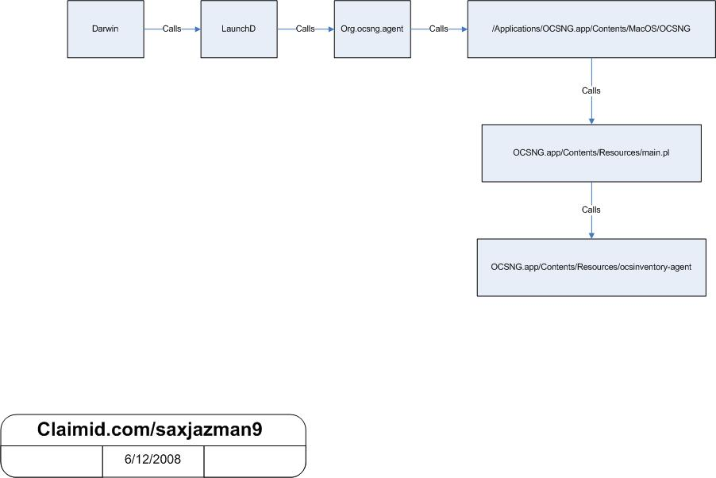

## Files

### **OCSNG.app/**

Skeleton .app framework (working directory)

### **OCSNG.app.orig**

Skeleton .app framework (original copy)

### **get-patch-cvs.sh**

Used to checkout the most current cvs code and add some darwin specific patches, prepare it for building

### **build.sh**

Used to build and bind the cvs code to the cocoa application

### **install-darwin.sh**

Used to add system users, install the package, install the daemon service and launch the service

### **uninstall-darwin.sh**

Used to uninstall and remove users from the system

### **dscl-adduser.sh**

Used to add user: _ocsng and group: _ocsng to the system (UID/GID: 3995)

### **dscl-remove-user.sh**

Used to remove user and groups from local host

### **Darwin-Cocoa Wrapper (XCode Project)**

Source code to build your own native Cocoa .app

### **org.ocsng.agent.plist**

Launchctl plist file used to launch the service at boot

### **OCSNG.pmproj**

PackageMaker project file. Used to build the .pkg package. Settings file able to be opened with PackageMaker.

## Package-Root Structure

* /Applications/OCSNG.app - where the application gets intalled
* /Library/LaunchDaemons/org.ocsng.agent.plist - LaunchD file for launching service
* /etc/ocsinventory-agent/ocsinventory-agent.cfg - default config file for target system
* /var
    * lib - where the default server settings are stored (.adm and .conf files from the server)
    * log - where the log file is stashed

## OCSNG.app Structure

* OCSNG.app/Contents/
    * MacOS/OCSNG - i386/ppc binary image
    * Resources/
        * main.pl - script OCSNG binary calls by default (compiled in)
        * ocsinventory-agent - script called by main.pl
        * lib/ - local library for ocsinventory-agent, includes system specific perl dependencies

## Building the Agent

(You will need Xcode tools and PackageMaker installed under /Developer for this)

* cd into the package-root directory. This will emulate the root directory for the target system we'll
be installing to.
* Modify pacakge-root/etc/ocsinventory-agent/ocsinventory-agent.cfg file to match your default agent
settings
* run the get-patch-cvs.sh script to check out the latest cvs code, this will also patch a few things
for the darwin specific installation.
* Run the build.sh script using sudo (needed to ensure correct permissions on package-root directory
before package is built. This will do the perl Makefile.PL and such, then copy the core code to the
.app framework, set the permissions and build the resulting .pkg for deployment.

## Application Flow

